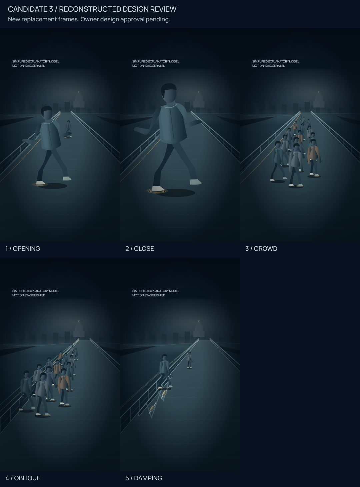
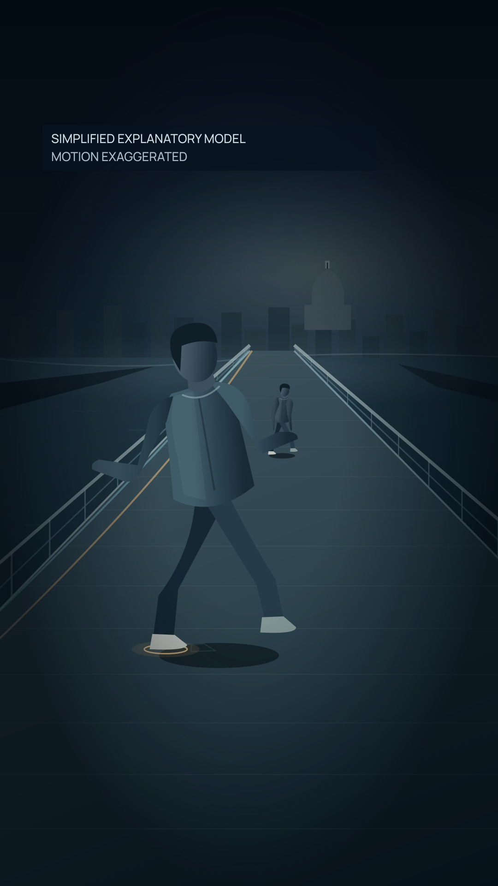
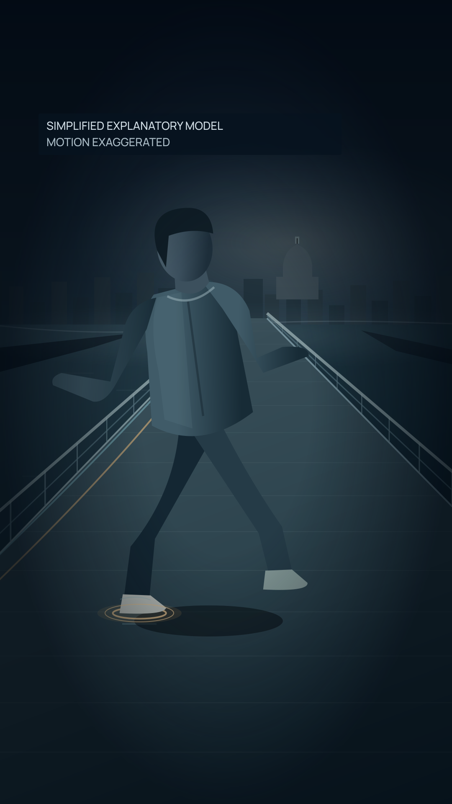
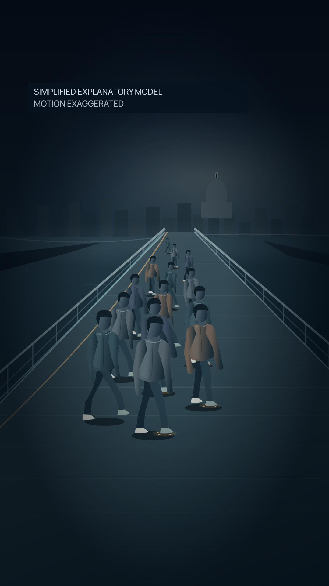
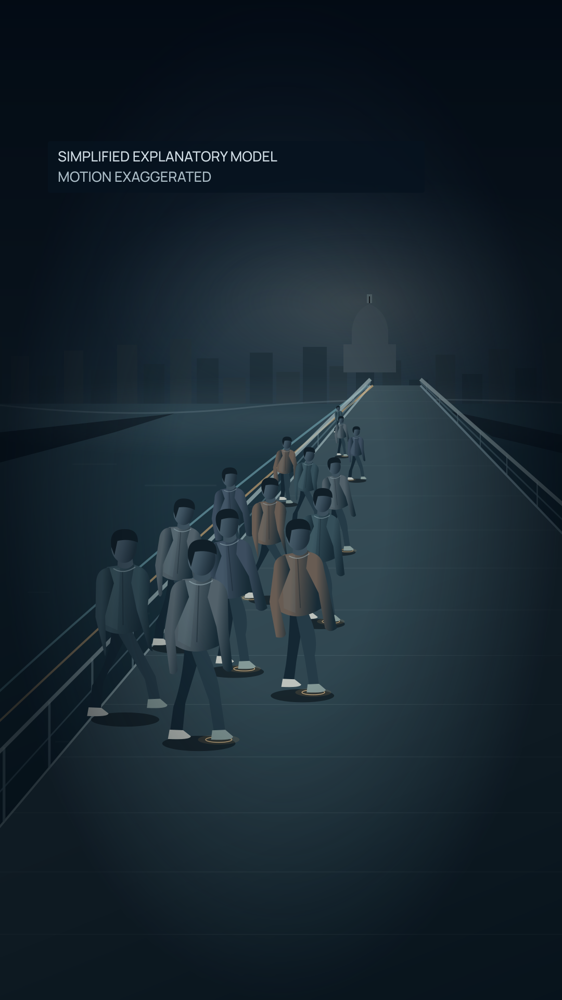
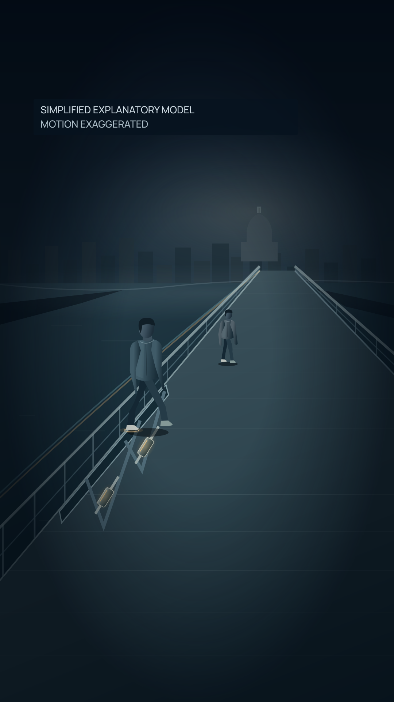

# Millennium Bridge Candidate 3 — reconstructed design direction

More physical, more cinematic, more human; one believable structural world with filled pedestrians, depth, contact-driven causality and restrained mechanism traces.

These five 1080×1920 frames are newly generated reconstructed replacements, not recovered original PNGs. Editorial approval is recorded separately. Owner design approval is pending; full Candidate 3 production remains unauthorized.

## The bridge moves. The body responds.

A substantial foreground walker leans and widens a step on a laterally displaced deck. Receding rails and riverbanks establish a physical place immediately.

PNG SHA-256: `3eb39c955147b35a8235b794e352f7f5451a74b2ff66ccc25fc995e21afec02e`. Source SVG: [01-balance-paradox.svg](01-balance-paradox.svg).

## Balance becomes a lateral step.

Closer body-to-foot framing makes the corrective lateral placement legible. A small warm contact pulse sits on the deck, with a faint previous-position shoe witness.

PNG SHA-256: `e1a64180ba5d1b3967167a21eff062944ed514a7c1b8c0e34f5cc809cb66e691`. Source SVG: [02-foot-placement.svg](02-foot-placement.svg).

## Many corrections. One moving structure.

Varied body sizes and gait phases recede into the same bridge. Staggered contact pulses and bounded edge-position witnesses indicate collective response without unanimous marching.

PNG SHA-256: `f1014706c97e27a9f2826c0be29697455f0cc2a0370fe00be0366dc13f58a926`. Source SVG: [03-crowd-feedback.svg](03-crowd-feedback.svg).

## Coordination can change the response.

An oblique bridge remains active. One small local pair has closer phases while the surrounding walkers differ; this is an illustrative possibility, not reconstructed opening-day evidence.

PNG SHA-256: `ae43ff4cfbd7cc15de3a707d7dd61fcb5b5f3eea953b67dc788f09f82d718882`. Source SVG: [04-coherence-uncertainty.svg](04-coherence-uncertainty.svg).

## The structure sheds energy.

The same bridge vocabulary shifts to an underside-aware oblique view. Integrated viscous-damper abstractions connect deck and bracing; warm dissipative accents and tight, nonzero position witnesses suggest controlled response.

PNG SHA-256: `f7f5bd1bd02fbf1b94277b67ff154388fe7c7df3156c6177b952c822f533c71a`. Source SVG: [05-damping-payoff.svg](05-damping-payoff.svg).

## Local QA and limits

The separately recorded [local visual inspection](local-qa.json) binds its actual inspection time to the five PNG hashes and contact sheet. Its checksum is local-qa.sha256; generation never manufactures a new visual inspection.

Each frame has the same readable two-line Manrope disclosure near the upper-left interior: SIMPLIFIED EXPLANATORY MODEL / MOTION EXAGGERATED. It is separate from captions; no sample narration captions or final CaptionPlan exist.

Declared critical rectangles fit surviving YouTube Shorts V1 and TikTok V2. There is no surviving YouTube V2 profile. Environmental geometry can bleed to canvas edges. These are local sanity checks, not real-device evidence or platform approval. Meta surface geometry is not reconstructed.

SVG and PNG dimensions, new hashes, approved editorial source/decision bindings, six-beat coverage and deterministic regeneration are validated. Pinned Sharp/libvips/librsvg versions and bundled font identity are in manifest.json. A future renderer/environment must verify hashes rather than assume byte identity.

Original procedural/vector artwork only; no footage, copied figures, textures or identifiable faces. Integrated damper hardware is an explanatory abstraction, not an engineering installation drawing. Warm contact/dissipation accents and edge-position witnesses are uncalibrated explanatory marks, not measured force or energy data.

Candidate 1 and Candidate 2 are historical rejected versions; their exact original source/bytes were not recovered and no replacement media is made. Reconstruction resumes from the owner-preferred Candidate 3 thesis.

## Next owner gate

Ahmet reviews these exact five PNG hashes for human physicality, bridge depth, contact/response causality, varied crowd phases, coherence uncertainty, damping payoff, disclosure legibility and cohesive art direction. Approve or request revisions. No full video is rendered until explicit approval of these reconstructed frames and subsequent production authorization.
