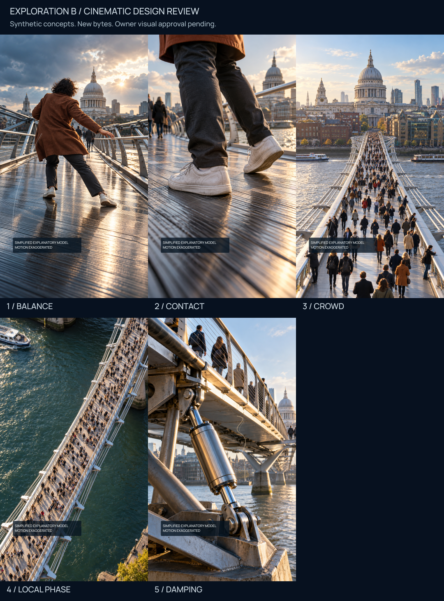
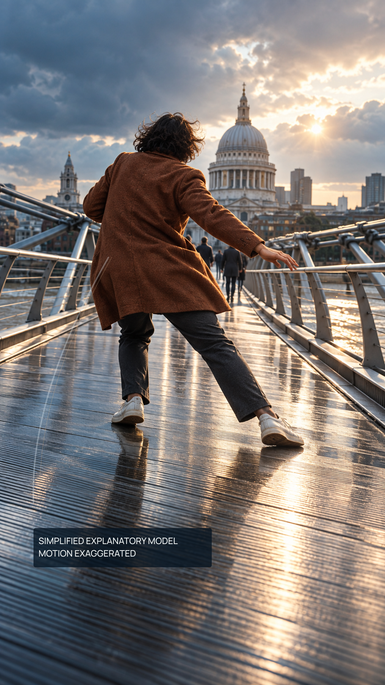
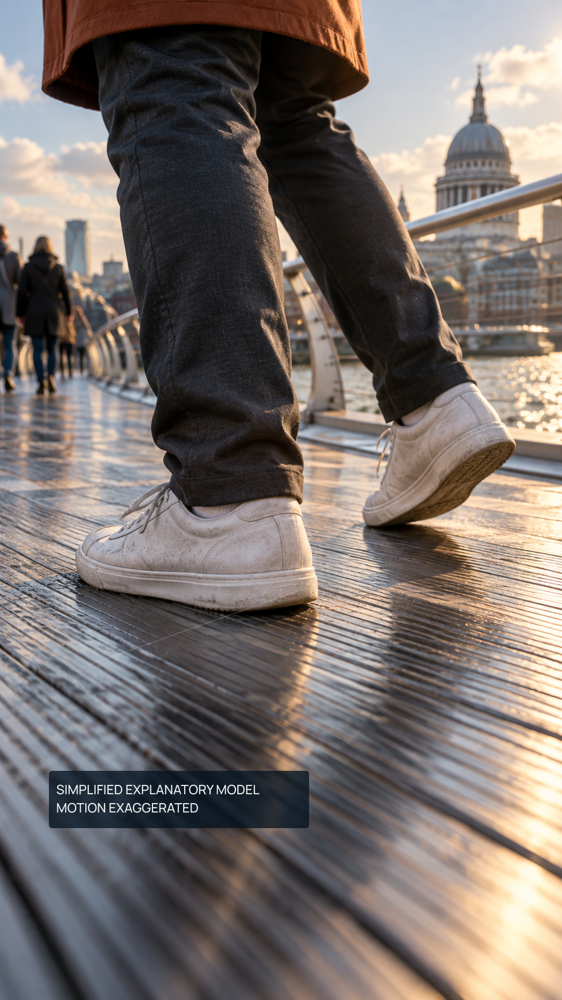
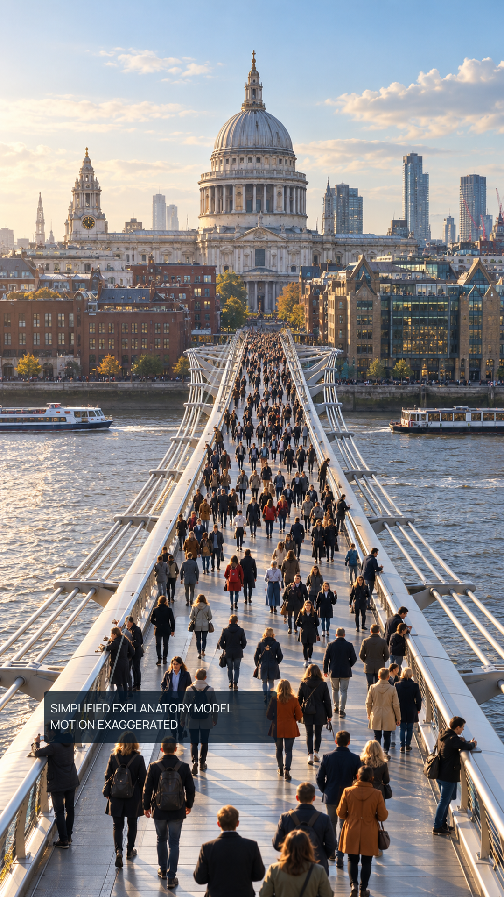
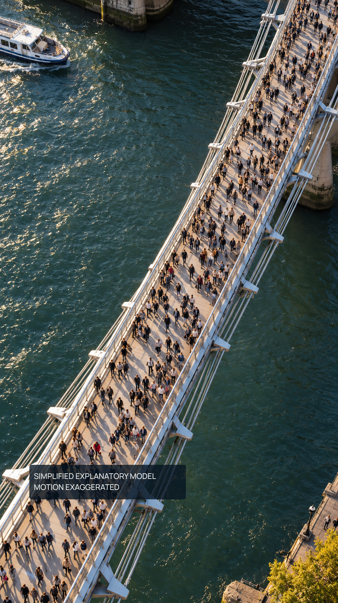
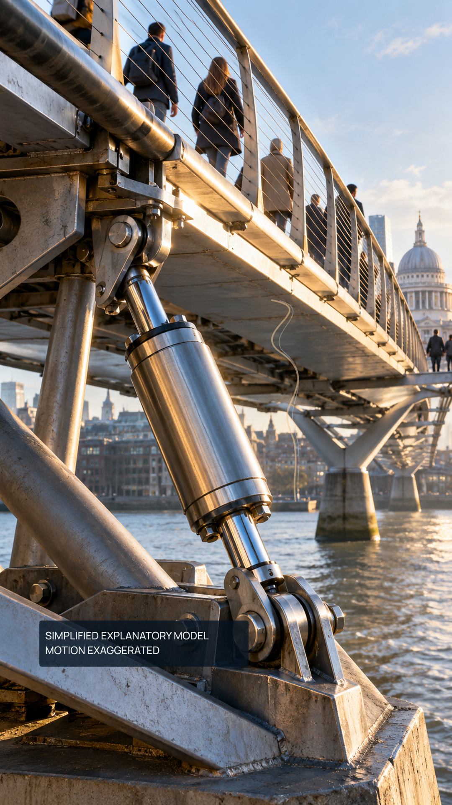

# Millennium Bridge — Design Exploration B

A human physical contradiction, tactile mechanism, crowd-scale reveal, overhead phase study and satisfying hardware payoff: cinematic shot variety with rich original assets and exact restrained compositing.

These are newly generated synthetic design concepts, not recovered frames or documentary photographs. Research, all 18 scoped claims and the exact approved narration remain unchanged. Exploration A is preserved and separately rejected for art direction. B is pending owner visual review. No full production or platform activity is authorized.

## The ground shifts beneath a person

Readable corrective lean, bent legs and searching foot, original textured coat, luminous metal deck and London depth replace the flat mannequin scene. Shot: Human-scale low 35 mm.

Future motion intent: Gentle push toward the planted shoe; lateral deck movement must precede corrective body/step action. Transition: Match cut from searching shoe to near-deck close-up.

SHA-256: `e9dc99564d1b97e913a91b1031803c3342b0b349eea7b4a67c8bca2db9f4c247`. Source: [sources/01-opening-original.png](sources/01-opening-original.png); overlay: [01-opening.overlay.svg](01-opening.overlay.svg).

## Weight transfers through a corrective step

Tactile soles, compressed stance and leg geometry communicate contact without rings, panels or large force arrows. Shot: Near-ground shoe/detail macro.

Future motion intent: Deck slides beneath a controlled planted sole; seeking foot lands laterally. Background remains secondary. Transition: Contact/steel texture match cut expands to crowd.

SHA-256: `efe7a92e38c1c818b68c46df7f76ccc21663cdddb1a4a7955c4caaf700121ca9`. Source: [sources/02-step-original.png](sources/02-step-original.png); overlay: [02-corrective-step.overlay.svg](02-corrective-step.overlay.svg).

## One correction becomes a crowd response

Many naturally varied people and a long physical bridge over the river establish a scale increase; bounded edge exposures suggest aggregate motion. Shot: Wide elevated long-lens scale reveal.

Future motion intent: Reveal bridge depth; independent walkers/contact phases accumulate into lateral deck response, never uniform marching. Transition: Rise and rotate into overhead spatial study.

SHA-256: `12b6dbce16cc16e15598c0e06eb78c4dd8a94974c6395e85d5e757d04fa86cfb`. Source: [sources/03-crowd-original.png](sources/03-crowd-original.png); overlay: [03-crowd-feedback.overlay.svg](03-crowd-feedback.overlay.svg).

## Local relationships within varied motion

Diagonal deck, river texture and spatial clusters replace another frontal crowd view. Sparse trails suggest local relationships without a universal synchronization claim. Shot: Elevated overhead diagonal.

Future motion intent: Selective sparse temporal witnesses mark two illustrative local phases while surrounding walkers vary; no inferred historical fraction. Transition: Follow a structural edge into damper detail.

SHA-256: `6a12a4e1fa3cfe62e86f33be7a4f5506606eaea773e5986c44bef825777a1c01`. Source: [sources/04-overhead-original.png](sources/04-overhead-original.png); overlay: [04-local-coherence.overlay.svg](04-local-coherence.overlay.svg).

## Motion is absorbed by the structure

A prominent tactile damper is physically pinned to supports; shrinking exposure witnesses make the response change more visible than A’s tiny hardware. Shot: Integrated hardware macro with bridge continuity.

Future motion intent: Piston/anchors carry relative structural motion; exposure envelope decays from large to small but nonzero response. Transition: Resolve promptly on the controlled structure; no outro.

SHA-256: `b8df0de594298b3780375d59a7c813b038238b0c5a3d33694014754876806e2b`. Source: [sources/05-damper-original.png](sources/05-damper-original.png); overlay: [05-damping.overlay.svg](05-damping.overlay.svg).

## Assess the direction

1. Does the opening stop the scroll?
2. Does the pedestrian feel human rather than mannequin-like?
3. Is the corrective reaction physically readable?
4. Does the bridge feel like a place?
5. Is foot placement intuitive?
6. Does the crowd escalate scale?
7. Is the overhead coherence scene distinct?
8. Is the damping payoff immediately understandable?
9. Is shot variety sufficient?
10. Does the direction feel like Magnivis?
11. Can the proposed motion pipeline sustain this quality?
12. Are sources reproducible and provenance-safe?

## Pipeline, provenance and limits

Read [pipeline assessment](pipeline-assessment.md), [comparison with A](comparison-with-a.md), [source metadata and exact prompts](source-assets.json), [manifest](manifest.json) and [local inspection](local-qa.json). All five PNGs are 1080×1920 deterministic compositions of hash-frozen 941×1672 generated sources. Re-prompting creates new identities; it cannot reproduce the current sources. Model/seed/usage IDs were not exposed by the built-in tool and remain null. Provider-output terms apply; no CC0 or uniqueness claim is made.

The two-line model disclosure is consistent, readable and separate from captions. For animation, disclose at mechanism onset and reintroduce for the hardware abstraction, with duration/readability tested in the future prototype. No final CaptionPlan exists. Sparse edge/trajectory witnesses are uncalibrated artistic cues, not plots or copied scientific figures.

Declared critical rectangles fit YouTube Shorts V1 and TikTok V2. Context may bleed; this check does not automatically identify every important pixel. Meta geometry is not guessed. The later Meta milestone requires actual owner screenshots/evidence after master approval: dedicated Instagram grid cover; separate Facebook Reel/feed testing.

Static stills demonstrate art direction, not animation readiness. Generated geometry and shot-to-shot human/hardware consistency are illustrative. A future layered environment, controlled body/foot poses and deck/damper motion prototype must establish causality and continuity; simple zooms over these images are insufficient. The fixed photograph-like frames alone cannot prove sway or energy dissipation, so future motion must carry those causal changes.

## Next human gate

Ahmet must approve or reject these exact five B PNG hashes. Approval of still art direction is not authorization for a full video, Meta reconstruction, variants, delivery or publication.
