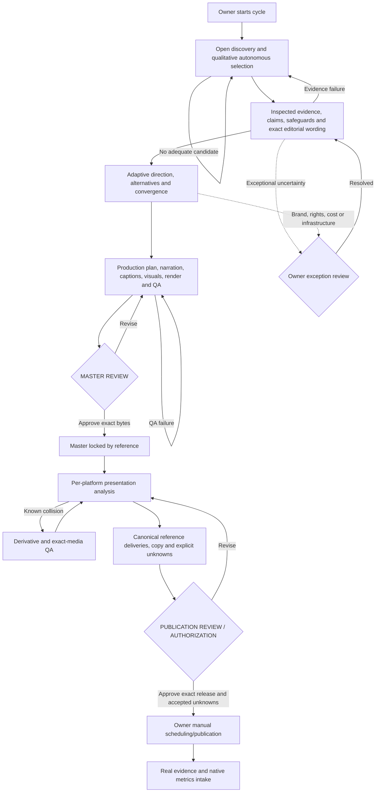

# Magnivis Cycle V3 — current prospective workflow authority

Ahmet approved the remediated V3 architecture at commit `5775c8aa85676d7b0bbc8ea4b771de8594e9fdc1` and authorized its history-preserving integration into main. It is the current prospective workflow baseline; at integration the project was idle and Cycle #4 was not started. Subsequent explicit cycle-start instructions and independent journals own current workload state. It supersedes prospective per-topic, per-claim, editorial, direction and production continuation gates in earlier documents. It does not change historical approvals, current narrator, cadence, publishing window, brand, evidence, rights, captions or platform uncertainty. The architecture integration itself did not start Cycle #4.

## Normal interaction

Start a cycle with explicit owner workload authority. The session performs internal discovery → evidence/editorial → creative direction → production/QA until **MASTER REVIEW**. Approval locks precisely the reviewed candidate without copying or changing bytes. Rejection/revision preserves the prior receipt and returns to production; factual/script changes require renewed editorial and direction receipts. Internal presentation analysis/adaptation and delivery preparation continue to **PUBLICATION REVIEW / AUTHORIZATION**. Ahmet manually schedules or publishes; subsequent evidence/metrics ingestion is not an approval gate. There are **two normal human gates**. Starting new workload is authority, not a third intermediate review.



The diagram is an operational recipe; typed transitions enforce receipt dependencies. It is not a background producer or publisher.

## Authority and exceptions

Cycle-start authority permits normal internal operations within existing local capabilities and established costs. Escalate material evidence conflict, insufficient central evidence, sensitive/high-care judgment, unresolved rights/legal issues, purchases/new paid services/infrastructure, production cost outside established authority, narrator/brand policy change, destructive historical migration or unrecoverable ambiguity. Do not label normal artistic indecision an exception. Exceptions bind a concrete target; owner approval permits re-evaluation, never overrides a failed factual invariant or known collision.

Source bodies/PDF/manual inspection records, access quality, identities, locators, qualification assessments and full claim dispositions are required. A model proposal/search snippet is not verification. Internal editorial readiness has explicit `internal-evidence-review` authority; it is never attributed to Ahmet. Supported wording may become verified only through bound evidence review; conflicting/uncertain/unverified wording cannot be automatically promoted. Reserve/excluded claims remain unchanged. Exact script and narration-to-claim identity, misconception/comprehension review and production rights remain required. Inspection truth still depends on the accountable session/operator; hashes prove identity, not factual truth.

Direction normally chooses alternatives internally. `CREATIVE-DIRECTION.md` still owns adaptive variables/convergence; `src/design/brand-execution-policy.json` still binds af_heart, independent sound/caption/visual choices and story-led duration. Significant unusual policy/cost decisions escalate. Ready direction is not master or publication approval.

## Executable repository controller

`src/workflow/cycle.ts` validates transitions; `store.ts` uses an immutable event journal, optimistic revision, exclusive writer lock, exact evidence files and replayed authoritative state. Branch names are not state. `nextAction` distinguishes internal work, owner gate, exceptional gate and manual release. Receipts hold full discovery rationale, evidence/editorial inputs, direction, production plans/captions/audio/actual candidate/QA and release. `runUntilGate` accepts a session/agent executor for internal stages, validates each result and calls persistence before continuing. An internal executor cannot submit an owner or publication event. Failures leave state at the last valid receipt.

Commands (Node 22 within declared supported range):

```bash
node --import tsx scripts/cycle.ts start <owner-cycle-authority.json>
node --import tsx scripts/cycle.ts run <cycle.id> <session-executor.ts>
node --import tsx scripts/cycle.ts status <cycle.id>
node --import tsx scripts/cycle.ts advance <cycle.id> <event.json>
```

A future Codex session can receive one **start cycle** prompt, capture the actual cycle-start instruction and perform all internal stages without asking for continuation. It must produce and register real outputs and invoke transitions, or call `runUntilGate` with its executor. The CLI is a state/evidence controller, not a self-sufficient AI discovery/render daemon. There is no universal automatic custom-scene authoring engine. Missing capabilities/failing evidence must be reported honestly. No paid provider, scheduler, upload or analytics importer is added.

Qualitative selection evaluates an open pool, history novelty, evidence feasibility, explanatory payoff, visual potential, curiosity, production feasibility and portfolio diversity. Classification follows discovery. Existing renderers earn no preference; immature metrics cannot impose category/style rules. Inspectable comparison/rationale identifies the selected eligible candidate; no permanent numerical score/domain whitelist. Inadequate pools continue discovery or escalate.

## Presentation and release

V3 profiles carry replaceable ID/revision/hash, provenance, inspection/renewal times and separate composition, native exclusions, caption-safe and crop models. Each has measured/owner-reported/provisional/unknown state; unknown geometry is null. Export envelopes are data, not a universal 60-second/1080/30fps rule. Actual media is probed against its chosen profile. Historical export/safe-area registries remain compatibility models.

Evidence binds the actual media, platform, surface and profile, timeline duration and checkpoints. Claimed all-frame bounds require every frame; sampled evidence remains explicitly incomplete. Every current caption midpoint must be present before publication review. Hooks/payoffs/disclosures have separate checkpoints. Desktop/local evidence cannot invent a device pass. Known collision or device failure requires a derivative with its own actual-media evidence; no owner waiver overrides it. Unknown/provisional/stale geometry and unsampled motion require explicit itemized owner risk acceptance at publication review. This does not guarantee native UI safety where knowledge is unknown.

`release.ts` binds exact variants and file-byte manifest hashes, metadata/copy, canonical video/cover identities, source-master lineage and exact publication decision. Authorized upload resolution validates that chain and presentation uncertainties, then returns actual files. Plain historical `resolveDeliveryUpload` remains byte lookup. `scripts/resolve-delivery-media.ts --authorized <release.json> <decision-reference.json>` is the full V3 release resolver. Generic PublicationRecord registration resolves actual manifests and rejects wrong file digests; prospective legacy-model V3 manifests additionally require authorization evidence. V3 cycle publication observations bind exact authorized media/variant/manifest and remain separate from scheduling. Native platform-transcoded bytes are not represented as independently verified unless evidence exists.

## Storage, history and learning

One ordinary canonical artifact per unique payload. Platform references can share a master or transformed result; quality may require separate derivatives/covers. Promotion and authorization never copy binaries. Existing V1/V2 packages, recovery snapshots, historical source hashes and owner decisions remain frozen. V2's old milestone allowlist is removed; historical validators project original policy bytes at their checkpoint, while current policy has separate tests. No generic cleanup/deletion/GC or historical approval transfer is introduced.

`workflow/project-state.json` records project policy/review phase and historical operational evidence; it is not a single-active-cycle pointer. Each independent journal at `workflow/cycles/<cycle.id>/` is replay-validated. Project status scans those journals to expose production-active cycles, owner actions, authorized releases, owner-reported schedules, pending publication evidence and closed cycles. Many production/review/publication cycles can coexist; observations never overwrite global active state. Historical adapters report missing Wood Frog original, Phantom owner-reported publication, and Longitude/Chocolate owner-reported scheduling. They do not migrate or reapprove media. Metrics retain native definitions/time/windows/source/publication; `learning.ts` separates interpretations, maturity and weak/strong signal provenance. Early/unknown/hypothetical observations cannot be strong signals; causality/style copying is not inferred. Long-form remains unimplemented production and outside this short-form controller.

## Document authority

Current prospective orchestration/gates: this document. Brand/adaptive creativity: CREATIVE-DIRECTION and brand execution policy. Open-world eligibility/cadence/window: STRATEGY. Factual standards: RESEARCH-STANDARDS and KNOWLEDGE-PACKAGES. Caption fidelity: CAPTIONS. Immutable payloads: ARTIFACT-ARCHITECTURE-V2 with V3 integration here; durability: ARTIFACT-STORAGE. Presentation semantics: PLATFORM-QA with prospective typed profiles here. External state/native metrics: OPERATIONS/PERFORMANCE. `workflow/project-state.json` is project-level metadata; independent cycle journals and their derived overview are machine current state; PROJECT-STATE/DECISIONS and prior owner handoffs are historical records where dated. This precedence resolves old mandatory per-claim/editorial/live-provider pauses prospectively; old decisions are not rewritten.

## Prospective contracts and compatibility

`CycleDelivery` is the prepared release manifest in the Cycle V3 protocol; the earlier `DeliveryManifest` V1/V2/V3 formats remain compatibility/operator package formats. The cycle manifest adds preauthorization readiness, exact profile/evidence references, independently checked selected covers and raw file hashes. `workflow/operations.ts` adapts these prospective releases to the existing native PublicationRecord and MetricSnapshot schemas. The older operations registry continues validating historical/native delivery packages. This preserves old records rather than rewriting their state vocabulary. Variant identities/bytes are still referenced once; compatibility formats are not new media copies.

Production profiles must be bound in the plan before the candidate completes. Each target platform has exact-media preflight with all current caption midpoints; preflight may honestly identify derivative work for after master approval. The master handoff includes these results. Changed timing/caption position/crop/FPS in a derivative requires its own narration/caption inputs, matching actual frame rate, timeline checkpoints and exact-media production QA. Positive rational FPS is supported; frame indices remain integers and actual probe/source timing must agree. Each selected cover gets separate image dimensions/profile/presentation evidence; a video report cannot prove it.

Use `cycle.ts review <cycle.id>` for concise owner handoffs. `begin-internal` records real in-progress work; failed work does not become a candidate. `retry-internal` preserves the journal and returns upstream when wording/direction must change. `recover <cycle.id>` completes only a proven interrupted transaction; ambiguous/stale writer locks need explicit inspection. Closing requires actual publication evidence for every authorized variant and no unresolved consequential issues, with analytics honestly optional. Evidence/metrics may continue after closure without changing another cycle. Exclusive per-ID initialization prevents duplicate cycle IDs; no global publication-completion lock prevents backlog production.

`profile-compatibility.ts` can project exact historical inset knowledge into a prospective profile. Projection always retains provisional/unknown status, null crops/native zones, provenance and immediate renewal requirement. It never creates measured geometry, a device pass or new official platform limits. Future genuinely measured versions remain separate records. Live settings, platform processing, untested device/surface combinations and subjective aesthetics cannot be guaranteed by these local contracts.

## Blocker remediation contracts

Every release binds evidence and profile to the variant's actual platform AND surface. Exact evidence/media/profile identity remains enforced. Release completion, replay and closure require exactly the platforms in original cycle-start authority; silent omission/substitution fails. No scope amendment is implemented: a change requires a future explicit authority model, not editing targetPlatforms.

`src/artifacts/catalog.ts` supplies `openMediaCatalog`: an authoritative live view that reloads committed catalog additions during the same run and rejects removal/rewrite of existing identities. `persistMediaArtifact` validates canonical bytes, parents and deduplication under an exclusive catalog lock and commits additions by atomic rename. Existing catalog entries are immutable; an identical registration is idempotent. The CLI run uses this live view for stage execution, replay, persistence and resolution. The executor must persist new media through this interface before completing its stage. It remains a session adapter, not an included AI/render daemon.

Editorial `exceptionalConditions` are non-overridable unresolved factual/evidence blockers. `careAssessment` and typed `judgmentConditions` can request owner judgment for treatment, rights/legal/brand or scoped operational authority. The escalation targets the exact original internal review; the owner decision binds the exact exception envelope and target. Resumed review retains the original judgment fields and adds exceptionResumptions (exception record, decision record, resumedAt). Completion requires journal-authorized approval, exact unchanged proposal, cycle identity, decision validity, and current scope authority. Latest scoped decision supersedes earlier authority. Unsupported claims still fail regardless of approval. The resulting internal editorial authority retains approval digests for downstream plans.

`cycle.ts status` without an ID reports all independent cycles. Named status/review/advance/run/recover remain unambiguous. Initialization and per-cycle events do not write a shared active flag. Owner-review queues can contain several cycles, with two normal gates per cycle. Closing still requires publication evidence for the complete release, but closing is no longer required to start another production.

Authorized CLI upload resolution replays the persisted cycle and requires the exact authorized release and decision. Pure release inspection functions validate their supplied contracts; they are not substitutes for loading authoritative cycle state. Profile unknowns remain itemized and collisions remain unwaivable. No new measured geometry/device evidence is claimed.

Known bounded limitations: session executors perform actual discovery/production; stale locks or incomplete initialization require explicit inspection, not automatic authority guessing. Catalog/journal rename is atomic process-level persistence, without a power-loss/fsync guarantee. Replay costs grow with evidence; no cloud infrastructure/importer is added. Historical semantics and binary bytes remain frozen.
