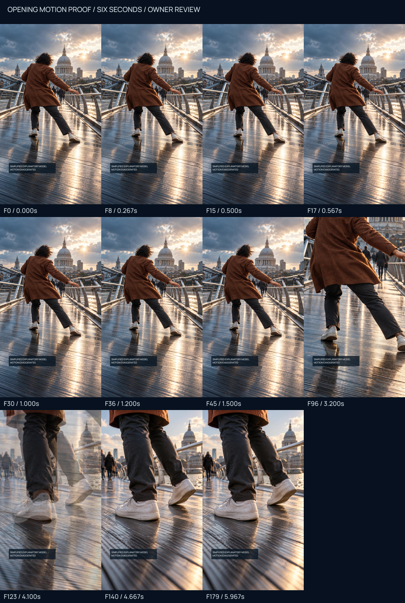

# Millennium Bridge — opening motion proof

[Watch the six-second prototype](opening-proof.mp4). **Pending Ahmet's motion review.** Exploration B art direction is approved; full production remains unauthorized.

The proof tests support/deck motion first, delayed human compensation, restrained free-foot correction and a camera approach/short optical dissolve toward the shoe/deck macro. It is silent and has no final captions. Both required model-disclosure strings remain readable.

Frozen B source bytes supply every pixel. No new generated imagery, frame-by-frame AI generation, morph model or generated intermediate pose is used. The [source/composition record](composition.json), authored `masks/` SVG/PNG influence fields, [manifest](manifest.json), [hashes](hashes.json) and [media report](media-report.json) bind the new proof. Source-render PNGs are in `frames/`; actual decoded MP4 samples are in `decoded/`. The sheet uses decoded samples.

Read [motion-design notes](motion-design.md), [pipeline assessment](pipeline-assessment.md), [damping accuracy review](damping-accuracy.md) and [local QA](local-qa.json). Local inspection examines required decoded frames sequentially, not continuous playback in the tool. Ahmet should watch the MP4 at normal speed and scrub it: the visual timing/comprehension gate remains human.

Judge: is instability readable in the first second; does support move before compensation; is the person anchored; do torso/arm/foot motions feel plausible; does the foot transition feel coherent; are texture deformation, camera crops or optical double exposure distracting? These are bounded image-space deformations, not a 3D reconstruction or mocap. The short dissolve intentionally overlaps two fixed shots; it is not AI morphing. Larger pose/occlusion changes would require a richer controlled rig.

The damping image's literal specificity is not approved as engineering documentation. It needs an original explanatory redesign or separate installation evidence before final production. No damping sequence, crowd/coherence sequence, full film/audio, Meta geometry, variant, delivery, upload or publication is implemented.

**Next gate:** Ahmet approves or rejects this exact MP4/hash and its opening causal motion, contact anchoring and macro transition. Approval does not by itself authorize the complete film.
