# Magnivis system architecture audit — October 2026

**Inspection milestone. Next human gate: AHMET — MAGNIVIS SYSTEM ARCHITECTURE AUDIT REVIEW.**

Production is paused by the audit instruction. No Cycle #4, research of a new subject, generation, render, encoding, media modification, external platform action, merge or remediation was performed. This report describes repository evidence, not a replacement policy. Paths below are repository-relative; the companion evidence index binds them to SHA-256 at the inspected commit. Historical handoffs are interpreted at their own revision, not as current authorization.

## 1. Executive architectural summary

Magnivis is a local, file-backed, AI-assisted editorial and audiovisual production system with strong provenance and human release control. It is also a brand and policy corpus. Its most developed subsystem is short-form production. It has typed research/editorial/creative/production/presentation/delivery/publication representations, but **no implemented autonomous end-to-end controller**. Codex supplies much of the orchestration through owner-authorized sessions and content-specific scripts.

There is substantial justified rigor: statement-bound evidence review, exact editorial and candidate approvals, separately identified recovery replacements, narration-faithful captions, immutable review media, platform uncertainty accounting and raw analytics definitions. Rigor is unevenly enforced: schemas can verify internal consistency but cannot independently authenticate an owner message, source truth, subjective quality or platform behavior. Some generic APIs have weaker checks than recent content-specific validators.

The current checkout is ahead of main by the Longitude, Chocolate and V2 milestones. Main is through Phantom Traffic closure; it does not contain Cycles #2/#3 or Artifact Architecture V2. Treating checkout policy as already merged main policy would be inaccurate.

Artifact V2 is a coherent prospective separation of immutable bytes from workflow state. It preserves freedom to create distinct platform media and correctly avoids deduplicating unlike presentations. **It is not established as merge-ready solely by its tests.** Important review findings concern permanent milestone allowlists, partial publication integration, source/provenance validation limits, fixed export envelopes, and the difference between upload-file lookup and complete authorization validation. No merge/revision decision is taken here.

Native UI safety is not guaranteed. Recent releases used explicit owner risk acceptance with zero current prepublication device passes. Local geometry and decoded-caption checks are valuable evidence, but missing native exclusion zones and grid/feed geometry remain missing.

## 2. Scope, Git reality and evidence method

Starting working tree was clean. `git fetch origin` succeeded. Local main and origin/main both: `cdebc2d1c92e14137dfef0dd9acb5924c460bed2`. Starting HEAD and origin/architecture/artifact-v2-canonical-media: `46322f0f5174d2639a03b5378ff7c7d90d8fa77b`. V2's immediate parent is `f7525176463b4e80045fb6d5d1e84de8de160569`; this is the proper baseline for attributing V2 changes. The full main→V2 diff also contains two content cycles and narrator policy changes; these are not all V2 changes.

Audit branch: `audit/magnivis-system-architecture-2026-10`, created from 46322f0. No main checkout mutation or merge. Branch creation needed filesystem escalation because `.git` was read-only in the ordinary sandbox; it succeeded. Commit/push receipt is separate to avoid a self-referential ending-commit hash.

Method: canonical document inspection; focused source/schema/validator/generator/test review; main and parent Git comparisons; native records and four representative cycle handoffs; SHA-256 inventory of every tracked MP4/WAV/PNG/JPEG/WebP; existing contact-sheet inspection; offline validation and non-mutating negative probes. No external platform/source reinspection: the subject is what the repository knows. Source URLs in records are provenance, not newly verified external facts.

`evidence-index.json` inventories hashes of text/code/record evidence. An inventory is not proof that every line received equal-depth scrutiny. This audit is comprehensive at subsystem/lifecycle level; it is not an independent factual re-verification of every published claim or a listening review of every audio file. Unknowns and validation limits are explicit below.

## 3. What Magnivis actually is today

| Layer | Implemented representation / execution | Limits |
|---|---|---|
| Brand/editorial policy | AGENTS, BRAND, STRATEGY, CONTENT-BIBLE, RESEARCH-STANDARDS | Policy is broader than available producers |
| Discovery | TopicCandidate, qualitative TopicEvaluation, per-cycle pool/triage/reconnaissance records | External discovery is session-driven; no crawler/ranker/scheduler |
| Research | SourceLead, ResearchWorkspaceDraft, known-URL HTTP retriever, source inspections, claim ledger | No automatic evidence truth determination; retriever handles HTML/plain text, not PDFs |
| Knowledge | Zod KnowledgePackage, claim/source registry, scoped review snapshots | Some legacy videos remain facts; approval metadata is trusted input |
| Editorial | ContentAsset script/beats/VisualPlan; scoped/complete owner decision helpers | No universal workflow service or CMS |
| Creative | Hash-bound CreativeDirection, convergence review, provider proposal workflow | New medium often needs authored code; aesthetic judgment remains human/agent |
| Production | ProductionPlan, VideoSpec, Remotion/React/SVG, modular WAV/audio, CaptionPlan | Content-specific preparation/render/QA scripts coexist with generic tooling |
| Presentation | PlatformVariant, dated export/safe-area profiles, surface QA/CoverAsset | Native geometry incomplete; local checking is not a device guarantee |
| Delivery | V1/V2 portable package files; prospective V3 reference packages | Ready does not authorize external action |
| Operations | PlatformAccount, PublicationRecord, settings, MetricSnapshot schemas/registries | No OAuth, uploader, scheduler, analytics ingestion or background jobs |
| Durability | ArtifactManifest, Git/local providers, exact restore, recovery decisions; proposed MediaArtifact | Git-backed at current scale; no cloud/LFS/GC integration |

There is no database, queue, worker fleet, application dashboard, autonomous publishing system or deployment service. The OpenAI Responses adapter exists behind `src/ai/`; recent cycles record session-assisted provenance rather than fabricated provider workflow runs. Fixture workflows are implemented and offline-testable. Availability of an adapter does not establish that a paid live call occurred.

## 4. Current short-form lifecycle and actual workflow diagram

This is the modern Longitude/Chocolate path. Wood Frog and Phantom predate first-class CreativeDirection and retain exact historical exceptions. Some stages share a single owner instruction; no fixed number of prompts is an architectural guarantee.

```mermaid
flowchart TD
  A[Owner authorizes bounded discovery] --> B[Open idea pool]
  B --> C[Classify, triage, evaluate and source reconnaissance]
  C --> D[Shortlist and finalist proposal]
  D --> E{Owner topic selection}
  E -->|hold or reject| B
  E -->|research only| F[Bounded research and source inspection]
  F --> G{Adequate evidence?}
  G -->|access failure or contradiction| H[Record limits, exclude, revise or hold]
  H --> F
  G -->|supported scoped claims| I[Review package, hooks, script and conceptual VisualPlan]
  I --> J{Owner evidence / finalization scope}
  J -->|revision| I
  J --> K[Final editorial wording and verification queue]
  K --> L{Owner exact claim / editorial approval}
  L -->|reject or change| F
  L --> M[Creative alternatives and convergence review]
  M --> N{Significant direction review or existing routine authority}
  N -->|reconsider| M
  N --> O[Ready direction and production authority]
  O --> P[ProductionPlan, authored visuals, narration, sound and CaptionPlan]
  P --> Q[Candidate render and technical / typography / caption / audio QA]
  Q -->|failure| P
  Q --> R{Owner master visual and listening review}
  R -->|revision with preserved old identity| P
  R --> S[Exact master lock; no byte change]
  S --> T[Platform requirements, critical bounds and independent covers]
  T --> U{Presentation evidence}
  U -->|measured adaptation need| V[Separate derivative, QA and approval]
  V --> T
  U -->|private preview separately authorized| W[Owner device / surface checks]
  W -->|failure| V
  W -->|pass| X[Production-ready variants and ready handoffs]
  U -->|explicit accepted uncertainty| X
  X --> Y{Separate owner publication authorization}
  Y -->|reject or amend| T
  Y --> Z[Owner manual upload / schedule / publish]
  Z --> AA[Owner / platform evidence intake]
  AA -->|scheduled only| AB[Scheduling report; publication still unknown]
  AA -->|publication evidence| AC[PublicationRecords and presentation observations]
  AC --> AD[Native metric snapshots when actual evidence available]
  AC --> AE{Owner cycle closure and merge authority}
  AD --> AE
  AE --> AF[Validation, PR reconciliation and main merge if authorized]
  AD -. human editorial learning .-> B
```

The diagram's arrows are reconstructed dependency/authority paths, **not implemented automatic transitions**. Revision loops must rebind changed statements/scripts/directions/media. An approval cannot silently follow edited bytes. Failed platform processing, copyright/disclosure uncertainty or wrong account/settings requires an operator stop and evidence; there is no API retry workflow. Generic rejection schemas do not implement a resumable revision controller.

### Exact answers to the 61 lifecycle questions

| # | Repository-supported answer | Primary evidence |
|---|---|---|
| 1 | Owner-authorized/manual candidate entry; source, audience, analytics, trend and legacy origin kinds exist | `src/content-intelligence/schema.ts` |
| 2 | Recent candidates are session-assisted broad ideation/external search, not an autonomous discovery provider | `content-intelligence/discovery/*/discovery-inputs.json`, `pool-input.json` |
| 3 | Open normalized domains/topics; no domain whitelist; finite pools do not prove exhaustive search | `src/knowledge/taxonomy.ts`, STRATEGY |
| 4 | Classification after idea pool; one portfolio pillar and open domains/topics | discovery provenance, taxonomy |
| 5 | Ten categorical dimensions with rationale/uncertainty; additional session triage/history/feasibility | `topicEvaluationDraftSchema` |
| 6 | Explicit triage dispositions; every shortlist candidate has evaluation/reconnaissance | `scripts/validate-discovery.ts` |
| 7 | Separate editorial finalist proposal; Cycles #2/#3 each have five finalists | `*/editorial-review.json` |
| 8 | Ahmet selected Phantom, Longitude and Chocolate through separate selection records | research `selection.json` |
| 9 | Required in current milestone handoffs and scope validators; not in generic candidate/research API | discovery validator vs `workflow.ts` |
| 10 | Separate bounded research authority, immutable discovery binding and research candidate revision | selections |
| 11 | Scoped central-question research, misconceptions, derivations, reserve/excluded claims | research bundles |
| 12 | Agent/session search and inspected source leads; HTTP retriever takes already-known URLs | `src/research/source-retriever.ts` |
| 13 | Human/agent inspection of body/abstract/targeted PDF; locator/evidence assessments | `source-inspections.json`, ClaimReview |
| 14 | Inspected/abstract-only/partially-inspected/inaccessible plus limitations; cycle ledgers add unused leads/failures | `sourceInspectionSchema` |
| 15 | AI candidates start unverified; assessed claims bind sources, locators, caveats and statement hashes | workspace and review schemas |
| 16 | unverified, supported, conflicting, uncertain, verified | `src/knowledge/schema.ts` |
| 17 | Adequate scoped evidence assessment plus explicit owner promotion/verification metadata | `claim-review.ts`, scoped decisions |
| 18 | Promotion to verified requires explicit owner decision in authorized workflows; support/exclusion assessment is assisted | claim-review helpers |
| 19 | Complete ledgers, reserve states, rejected/uncertain claims and downstream exclusion checks remain durable | production/reference validators |
| 20 | Different hook mechanisms proposed against supported claims for review or verified approved claims for production drafting | `workflow.ts` |
| 21 | Owner preference/final editorial approval selects exact hook/framing | finalization/approval decisions |
| 22 | Session-authored script or provider draft; factual segments bind selected claims, connective editorial segments do not | asset schema/prompts |
| 23 | Owner authorizes finalization, wording/claims/VisualPlan queue and comprehension contract bound | finalization bundles |
| 24 | Explicit exact reviewed package/asset/script/VisualPlan approval; separate scoped authority flags | creative-stage/editorial-lock helpers |
| 25 | Asset companion binds approved hashes, eight decision responsibilities, alternatives and recent-content rationale | creative-direction schemas |
| 26 | Three medium approaches in Longitude and Chocolate; no universal three-option schema requirement | creative handoffs |
| 27 | Hash-bound precedents, similarities/differences/applicability; unresolved convenience reuse blocks readiness | direction schema/integrity |
| 28 | Frame allocations, on-screen facts, scene intent, assets and editorial/direction/script chain | production schema/integrity |
| 29 | Current primary af_heart; material deviation rationale; historical Longitude bf_emma proposal predates policy adoption | brand execution policy/adoption |
| 30 | Local Kokoro bounded text clips; exact WAVs retained and measured, cue starts/gaps authored | narration generators/JSON |
| 31 | Independent per-story direction and deterministic authored sound generators; no mandatory music | creative records/audio scripts |
| 32 | Speech-first phrase grouping, exact punctuation reconstruction and selective emphasis | CaptionPlan V1/V2 |
| 33 | Measured cue boundaries plus authored phrase estimates/low-energy gaps; explicit bounds/style/renderer; not guaranteed forced alignment | production owner handoffs |
| 34 | Bespoke original procedural SVG/React/2.5D scenes rendered with Remotion; no speculative image/video generator orchestration | compositions/components |
| 35 | Asset origin/rights/evidence in plan, pinned fonts/licenses/hashes, ASSET-LICENSES | production assets/provenance |
| 36 | Authorized render, retained candidate receipt and durable exact MP4/audio/QA; unapproved state | production handoffs |
| 37 | Type/lint/tests; source/hash/caption validation; ffprobe/full decode, volume/ASR, sample typography/frame checks | check/QA scripts |
| 38 | Truthfulness of visual implication, beauty, comprehension, voice/mix, synchronization and device presentation | owner-review handoffs |
| 39 | Explicit message bound to exact candidate, source commit/receipt/plans/audio | master decision/schema |
| 40 | New logical master identity and locked plan revision, same MP4 path/hash; candidate record preserved | master-lock artifacts |
| 41 | Dated profile envelope + known insets + critical bounds + surface evidence; live settings/policy operator confirmation | platform profiles/QA |
| 42 | After master lock in modern practice; legacy assets/variants can precede production | platform collections |
| 43 | Yes, distinct VideoSpec/safe-area derivative; V2 adds arbitrary platform-specific derivative and media ref | variant schema/delivery |
| 44 | When selected source/master chain and technical/local bounds pass; device approval or exact risk acceptance separate | `productionChainForVariant` |
| 45 | Independent original cover render or exact-frame recommendation; native selectors/crops unknown | cover evaluations |
| 46 | Generator resolves variant/spec, probes exact media, writes copy/metadata/checklist/hash manifest | delivery generator |
| 47 | Historical portable packages copy video/cover per surface/stage; candidates→locked masters already alias; V3 references canonical bytes | artifact inventory/V2 |
| 48 | Explicit owner release decision bound to exact variants/packages/media/cover; no implicit permission from readiness | release decisions/final-bindings |
| 49 | Append-only owner scheduling report; not a PublicationRecord scheduler state | operations scheduling JSON |
| 50 | PublicationRecord after evidence; distinct owner-reported publication when exact remote metadata unavailable | operations schema |
| 51 | Manual owner URLs/IDs/date/settings/observations; intake files are empty until evidence supplied | publication intake/closure |
| 52 | `remote.postId/url`; missing TikTok permalink explicitly allowed in owner-reported state | Phantom operations |
| 53 | Hash/surface/context QA and separate qualitative live owner reports; no invented measurements | presentation/closure records |
| 54 | Native MetricSnapshot capture/window/definition fields; currently empty production registry | operations schema/registry |
| 55 | Human hypotheses and discovery/history inputs; no automatic metric-to-topic/style decisions | PERFORMANCE/discovery inputs |
| 56 | Owner confirms release/presentation scope with gaps and authorizes closure; no generic close command | Phantom closure |
| 57 | Explicit authority, validation, PR reconciliation/merge and remote proofs; audit does none | closure receipts/Git |
| 58 | Evidence branches preserved; no automatic deletion or encoded universal branch GC | branch refs/recovery docs |
| 59 | Scope, topic, exact verification/editorial, significant direction, production authority, master, external preview/release, closure/merge, exceptional risk/paid/rights/infra | gate matrix below |
| 60 | Invoked generation/validation/lookup/render/package/hash operations within authorized scope | CLI/API implementations |
| 61 | Broad discovery, source inspection, editorial/art decisions, next-stage orchestration, platform evidence entry and closure are mostly prompted sessions | cycle records/scripts/Git chronology |

## 5. Owner interaction and gates

`owner-gates.json` contains the detailed gate matrix: artifacts, authority layer, invariant, actual cycle use and approval/rejection paths. These are distinct decision purposes, not necessarily distinct messages. Approval identity/time text is not cryptographic proof of a human action.

| Gate | Decision / artifacts / protected invariant | Enforcement and actual use | After yes / no; distinct judgment |
|---|---|---|---|
| New content scope | Authorize discovery cycle; current state/scope | AGENTS/docs and cycle inputs; no global scheduler; all recent cycles | Start bounded discovery / remain paused. New workload authority |
| Topic selection | Choose finalist for research; pool/shortlist/finalists/risks | Discovery handoff validator requires pending/null selection; later scoped selection validates owner instruction. Generic API has no owner selection field. Phantom/Longitude/Chocolate used | Bounded research / hold, alternative or new discovery. New editorial portfolio judgment |
| Live research source/claim pause | Inspect model-proposed leads/claims; run review | CLI all-stage live trial prohibited; docs mandatory pause. Fixture trial differs; recent research manual | Supported review proposal / revise evidence or stop. No factual authority from AI |
| Research acceptance / finalization | Accept evidence basis and preferred framing; ledger, source access, hooks, draft | Scoped owner instruction/decision + cycle validators, used recent three | Finalize wording; Longitude did not yet verify, Chocolate/Phantom instruction verified scoped subset / research or framing revision. Partial overlap with final editorial but object/scope differs |
| Exact claim verification | Approve exact statements/evidence/caveats and exclusions | ClaimReview `ownerDecisionRequired:true`; promotion helpers/CLI flag require decision; recent cycles plus Wood Frog | Only approved scoped claims verified / rejected/uncertain/reserves preserved. Sometimes bundled with another gate |
| Final editorial approval | Approve final script/hook/beats/VisualPlan/comprehension | Approved package/asset required downstream; hash-bound complete/scoped decisions. All four | Approved sources, creative-only or production scope as instructed / upstream revision. New final wording/visual implication judgment |
| Significant CreativeDirection | Approve new experience and production scope; alternatives/convergence/risks | Direction requires decision only if `ownerReview.required`; AI remains proposal. Longitude/Chocolate required; Wood Frog/Phantom historical exemptions | Ready companion plus candidate authority / reconsider. Not universally mandatory separate owner font/voice gate |
| Production authority | Permit planning/media/candidate spending; bound sources/direction | Docs/scoped authority; ProductionPlan checks ready/approved data but no universal renderer permission service. Recent candidates expressly authorized | Candidate work / remain at editorial/direction. Can be combined with direction approval |
| Narrator deviation / revision | Material deviation rationale or owner identity change; actual sample/candidate | Execution policy checks rationale; default af_heart; Longitude owner requested v2 replacement of bf_emma. Routine auditions not required | Separately bound audio/timing/candidate / keep unapproved prior evidence. Actual auditory judgment |
| Owner master visual/audio | Accept exact rendered MP4, captions/voice/mix | ProductionPlan visual state requires approval; master decision binds exact receipt/bytes; four cycles used | Lock identity, platform preparation / new authorized candidate revision. New actual audiovisual object |
| Private upload permission | Permit external private/draft preview | Explicit human policy; no upload implementation; no current device passes in Longitude/Chocolate | Owner uploads privately/checks surfaces / local evidence stays pending. External-action authority distinct from technical QA |
| Platform/device presentation | Judge exact media/cover on playback/grid/feed/desktop | Presentation real-device pass requires hash/context/device/time/reviewer/evidence; readiness models support risk acceptance. Phantom initial ambiguous report preserved, later waived; Longitude/Chocolate waived | Promote exact pass or record risks / adaptation loop. New external processing/UI evidence |
| Independent cover selection | Approve exact artwork/frame and crop uncertainty | Cover schema requires identity/decision on approved; delivery binds cover hash. Recent release decisions selected covers without device pass | Exact cover eligible / revise or choose another. Can share release message but not master approval |
| Accepted presentation uncertainty | Explicit release-specific waiver; incomplete reports/risks | Native `owner-risk-accepted` state and matching decision; all recent three releases used | Ready variant without a device pass / device review or hold. Risk judgment rather than newly measured quality |
| Publication authorization | Permit exact owner manual release; packages/copy/settings/cover | Decision/hash/operator-guidance checks and docs; ready alone insufficient. Recent three | Ahmet manual upload/schedule/publish / hold or revise packaging. External release control |
| Live settings / account confirmation | Choose correct account/visibility/disclosure/captions/cover/quality/category/comment controls | Manual checklist/docs; actual settings often unknown, no API enforcing live UI | Record actual evidence / stop uncertain upload. New account-specific reality |
| Publication / scheduling evidence | Report what happened, actual dates/IDs/URLs/comments | Schemas/append-only owner evidence and intake; not an approval inferred by time | Scheduling record or actual PublicationRecord / remain unknown. Evidence handoff, not a creative approval |
| Postpublication presentation / closure | Confirm actual presentation and accepted gaps; authorize closure | Phantom owner decision + validators, other cycles still pending live evidence | Operational closure without invented measurements / record issue and separately request remediation. New live observations |
| Merge/reconciliation | Authorize PR/main integration; diff/check/clone evidence | Owner docs/convention and exact closure receipts; Git no automatic policy bot observed | Main integration if authorized / feature/evidence branches retained. Integration authority |
| Paid API / questionable rights / infrastructure / irreversible external action | Authorize actual cost, rights exception or system expansion | AGENTS policy; AI adapter credential gating is not payment permission; no automatic rights clearance | Bounded authorized action / choose available permissible path or stop. Conditional gates, not normal-cycle mandatory paperwork |
| Recovery replacement / recovery closure | Accept separate replacement and lost-history gaps | Exact owner recovery decision/validators; Wood Frog incident only | Operational replacement/closed recovery / preserve missing expectation. Historical exceptional gates |
| System architecture audit review | Assess this inspection before any design decision | Current explicit owner instruction | Owner decides next scope / audit remains evidence only. No implicit remediation authority |

No universal separate owner gate exists for every caption cue, font, color, sound effect, hook alternative or safe-area coordinate. Their judgment is bundled into editorial/direction/master/platform scope unless a significant risk or explicit owner request makes it separate. Cadence/window are owner operating decisions, not enforced clock-triggered gates. No production waiting state can autonomously notify/resume from an owner response.

## 6. Autonomy boundaries and decision authority

**A — Implemented autonomy:** deterministic schemas/registries/reference validation; fixture structured workflows; optional provider evaluation/research/hooks/assets/direction; exact audio/script plumbing; invoked authored audio generation; render/ffprobe/decode/frame extraction; caption reconstruction; package generation; local upload lookup; artifact verification/restore. These run without further judgment once correctly invoked and authorized. They do not initiate themselves.

**B — Intended autonomy:** docs describe resumable stages, future discovery providers, retries/idempotent publishing adapters, analytics ingestion and learning. These are plans, not current controller/queue behavior. CREATIVE-DIRECTION explicitly permits routine agent creative finalization within existing authority.

**C — Manual decisions:** the gate matrix. Verification/editorial/master/publication human control is intentional policy. Significant direction is conditional in generic schema but expressly mandatory in recent milestones.

**D — Prompt-driven Codex:** open-world search/triage; inspection of full sources/PDFs; source-quality judgment; claim scoping; framing/wording; custom renderer implementation; audio decisions; QA interpretation; content-scoped scripts/manifests; branch creation/stage continuation; live evidence intake and closure. Repository stores outputs, not all owner prompts or a complete session execution trace.

**E — Apparent autonomy:** a ready direction, successful render, passing QA, production-ready variant or ready delivery does not imply the next human/external transition occurred. Empty evidence intake/analytics-readiness files resemble downstream capability but contain no actual publication/metrics. Fixture all-stage trial traverses drafts, not real verification/approval.

**F — Currently impossible safe autonomy:** end-to-end next-cycle execution; factual truth verification purely from model output; independently authenticated editorial/master approval; actual cross-device UI assurance from local profiles; external scheduling/upload/publication/analytics without new integration and authority. There is no implemented safe autonomous publisher. Conversely, a generic schema accepting asserted approval metadata is not a security barrier against code/users writing false data.

Can it choose its own topic? Generic candidate/evaluation/research functions can proceed from a `research` recommendation without an owner-selection record. There is no implemented chooser/controller that turns a pool into a selected operating topic. Current discovery validators preserve `selectedTopicId:null`, `ownerReview:pending-selection`; later selection records are owner-authored scope. This is **documented/scoped operational authority**, not an intrinsic universal TopicCandidate requirement. It cannot currently run research automatically after broad discovery, though `draftResearchWorkspace` can be invoked independently. Claims cannot be legitimately verified or editorially approved without explicit owner authority; helpers enforce decision structure and exact targets, not independently proven human identity. Direction can be ready under routine authority when review is not required; provider output cannot self-approve. Generic renderers do not provide a permission engine; production policy/validated inputs and specific scripts protect authorized practice. Master approval and release remain intentional owner boundaries.

## 7. Research, claims and evidence architecture

KnowledgePackage is the durable factual root; ContentAsset selects angle/hook/claims, ordered factual/editorial segments, beats and conceptual VisualPlan. Quantitative claims model scalar/range, precision, basis/unit and optional uncertainty; qualitative claims share evidence/status/caveats. Source identity may include DOI/PMID/authors and honest partial publication dates. Registry prevents conflicting reuse of global source IDs. No domain enum blocks legitimate new fields.

ClaimReview records exact statement SHA, retain/revise/reject recommendation, evidence locator/assessment/limitations and owner-decision requirement. Inspection status distinguishes inaccessible and abstract-only from full/partial inspection. Promotion checks stale wording, evidence eligibility, rejected hook/asset claims and uncertain states. Complete ledgers retain reserve and exclusion reasoning; production demands selected verified claims and implements each approved VisualPlan exactly once. General package semantics can retain approved uncertainty; current factual production path is more restrictive about the claims it actually renders.

HTTP retrieval records URL/time/content type/status/hash/normalized text/truncation, uses a 15-second timeout and a 250,000-character bound, and rejects non-HTML/plain text. Regex normalization is not a browser/PDF inspection tool. Full raw response is hashed but not necessarily retained; normalized text cannot reconstruct raw bytes. Manual PDF/body inspections in Longitude/Chocolate are stronger operational evidence than this retriever's capability. Search leads/snippets and AI drafts are proposals, not evidence.

Wood Frog demonstrates a meaningful exclusion: cardiac cessation, pulmonary cessation and thaw order are separate; circulation cessation stayed uncertain/excluded despite secondary summaries. Longitude preserves solar-time correction, same-instant comparison, sign/east direction, longitude-only result and complementary methods. Chocolate distinguishes polymorph/packing from larger network, retains fat vs solids and excludes unsupported diagnoses/recipe advice. Tests protect these scopes; they do not substitute for renewed expert/source inspection.

## 8. Creative architecture and convergence

Constants: accuracy/honesty, curiosity resolved into understanding, clarity/premium craft, meaningful visuals/readability, faceless English brand, provenance/human control and platform awareness. af_heart is the current auditory policy constant with explicit exceptions. Topic, hook, framing, script, structure, runtime/pacing, delivery/pauses/energy, music/ambience/Foley/SFX/silence, medium/art/palette/type/caption appearance/placement, transitions/camera/motion/diagrams/disclosure/cover/platform adaptation are story decisions. Claim meaning and approved wording stay bound; creativity cannot rewrite evidence silently.

Adaptive Creative Direction V1 adds a companion, not another editorial hierarchy: package/asset/script hashes, thesis/experience, eight mandatory responsibilities, optional other dimensions, convergence precedent references and risks. `proposal`→`ready-for-production-planning` refuses unresolved convenience reuse and requires an owner decision if owner review is marked required. Validator binds actual source objects. Future ProductionPlans require the exact ready companion; only exact historical plan hashes bypass it. No automatic style classifier or pixel-similarity/novelty metric exists. Empty unresolved-risk arrays and narrative rationale remain judgments.

Longitude compares three treatments and seven prior works: selected matte object theatre, Source Serif/Sans, ivory/aubergine/sea-green/terracotta, planar meridian proof and quiet captions. Chocolate compares three treatments and eight precedents: selected material cutaway, lilac/cocoa, Atkinson humanist typography, fat/solids and two-scale analytical views. Its described “3D” medium is implemented as authored SVG perspective/relief geometry, not a physically rendered 3D engine. This may meet an illustrative treatment but the wording must not imply a implemented Three.js/physical renderer.

Inspected existing contact sheets: Wood Frog anatomical/process diagrams; Phantom overhead loop/vehicles; Longitude navigational objects/cards; Chocolate material/network/packing views. They are distinct explanations. Wood Frog/Phantom share historical dark palette/caption primitives; they are deliberately preserved, not retroactively judged against a later mandate. Longitude/Chocolate avoid historical tokens/fonts and use different implementations. They also share central authored diagrams, headings above and fixed phrase captions below, stable camera and sparse no-music sound. That is observable similarity, not proof of convenience-driven failure. Both directions justify continuity/readability and compare precedents; effect on audience/creative uniqueness is unmeasured.

Potential pressure remains from reusable safe-area, typography, caption and scene primitives; retained default `src/design/tokens.ts`; existing SVG production skills; fixed vertical export envelopes; reuse of same-story cover geometry; selecting easily authored media. Narrator continuity is deliberate owner policy, not accidental convergence. No schema forces the historical palette or renderer in future V2 caption paths. Brand policy permits broader media than currently operationally integrated. Formal convergence reduces unexamined reuse but cannot guarantee quality or originality.

## 9. Narration and sound

Canonical current primary narrator is Kokoro `af_heart`, explicitly chosen during Longitude candidate-v1 review and bound in `src/design/brand-execution-policy.json`. Domain changes alone do not justify auditions. Material deviations require rationale (format/accessibility/language/character/series/evidence); explicit future owner policy can evolve it. Existing pre-policy bf_emma proposals/production are frozen historical records, with hash-bound adoption exceptions. Longitude v1's audition rationale partly used tiny ASR sentence boundaries as weak cadence evidence; the repository correctly labels this as not subjective human naturalness/warmth assessment. V2 changes voice, measured timing and caption bindings while preserving exact script/art direction.

Local provider: Kokoro-82M ONNX q8 CPU with pinned kokoro-js; model download/cache availability is a dependency on a truly fresh environment. `kokoro-local.mjs` also exposes local whisper-tiny.en inspection; cache name `.cache/longitude-ai` is content-specific even for Chocolate. Exact WAVs, model/voice/speed, cue/sample counts/duration, script and cue hashes/generation times are retained. Model ID is not a guarantee of identical future model payload or MP4. No proven universal bit-identical TTS regeneration; retained bytes are authoritative.

Speed is authored: Longitude final 0.92, Chocolate 0.98; phrase pauses/comprehension holds feed timeline, not fixed runtime or monetization padding. Longitude 89 words, ten clips, 47-second authored V2; Chocolate 80 words, eleven clips, 35.225 seconds narration and 39.833-second timeline. Container padding is separately reported (47.062/39.900 seconds). Timing uses measured clips plus authored phrase segmentation, not a universal forced aligner.

Music, ambience, Foley/impacts/transitions, sound effects and silence are conceptually separate from narration. Legacy generators synthesize continuous ambient/scale/impact beds; recent Longitude uses low ocean context/tactile touches and silence under proof; Chocolate sparse tactile handling/flow/fracture with no continuous ambience/music. Original deterministic synthesis and audio hashes/provenance avoid sample-library rights ambiguity. Foley here is synthesized illustrative handling, not an actual recorded historical/measured event. Direction permits original music/other sound with rights, but there is no generic music sourcing/licensing/selection service. Recent no-score choices are observed; there is insufficient performance evidence to call them successful universal defaults. Narrator consistency and adaptive sound design are correctly separated in policy and execution fields.

## 10. Production, captions, renders and QA

ProductionPlan bridges approved source/direction to explicit format/frame beats/on-screen facts/animation/transition/audio/required asset provenance. VideoSpec owns composition, timing/audio/output; Remotion implements choreography. Narrow package projections preserve legacy numeric render inputs. Domain-specific visuals live beside reusable math/diagram/caption primitives; Longitude/Chocolate use separate entry points/targets and bespoke preparation scripts. There is no universal scene factory.

Generic routing is uneven: `scripts/render.ts` still uses historical `video-targets.ts` and `src/index.ts`, while `scripts/qa.ts`/delivery use `production-video-targets.ts`. Longitude/Chocolate have dedicated render scripts/entry points; the generic delivery missing-media message suggests `pnpm render <id>` even for these newer targets. Generic render also passes `--overwrite`; modern candidate-specific scripts contain stronger retained-media guards. Policy prohibits overwriting locked media, but the general renderer is not a universal immutable-master enforcement boundary. No render command was invoked in this audit.

Designed burned-in captions are required prospectively. V1 frozen grammar covers Wood Frog/Phantom (whitespace-preserving spans, selective semantic emphasis and explicit rhetorical-dash transitions). V2 authoring chooses font/appearance/renderer and cue bounds with exact script/direction/cue-order/timing reconstruction; it checks canvas containment, not actual font fit or native UI. Longitude uses ObjectTheatreCaptions; Chocolate renders captions directly in its composition with hard-coded visual values. Therefore appearance fields/intent in a plan do not by themselves ensure every renderer actually honors them. Caption midpoint decoding covers all recorded phrases, but does not prove synchronization at every boundary or every animation frame.

Technical QA: strict TypeScript/lint/Vitest, schema/reference/exclusion/hash validation, ffprobe dimensions/fps/codecs/duration tolerance, complete decode, volume analysis, independent ASR, exact sampled decoded frames, font-loading/browser bounds and contact sheets. Longitude has 56 source decoded observations and 24 caption midpoints; Chocolate 58 and 28. Scripts sample beat starts/middles/ends and selected transitions. Full decode establishes decodability, not every-frame semantic layout safety. There is no continuous automated native UI occlusion detector. ASR cannot establish subjective voice quality or factual truth. Audit viewed existing four contact sheets, performed no render or QA regeneration.

Human candidate review judges actual listening, caption sync/readability, comprehension, visual truthfulness, beauty/pacing. Master lock binds exact candidate/receipt/source/audio/captions and adds a new workflow identity/revision without changing video bytes. Rejection requires separately authorized revision, preserving old candidates. Rendering scripts can write outputs when invoked; policy/guards are not a centralized authorization engine.

Rights: original SVG/procedural imagery and synthetic original sound dominate; museum images are research/morphology references, not automatically licensed production pixels. Pinned OFL fonts retain licenses, hashes and provenance; Chocolate includes compressed exact upstream license plus readable whitespace-normalized copy. Model/provider license evidence and asset declarations matter independently of successful schema parse. Normal validation requires no paid credentials.

## 11. Platform adaptation and presentation QA

All four dated **internal export envelopes** are 1080×1920, 30 fps, vertical 9:16, H.264/AAC MP4, 3–60 seconds. These are conservative Magnivis profiles, not complete current platform specifications. Runtime guidance is adaptive in policy but delivery rejects media outside these envelopes; no implemented longer-short export path is proven. No current external limit was reverified in this audit.

| Platform / surface | Known internal model (top/right/bottom/left pixels) | Evidence strength | Remaining unknowns |
|---|---|---|---|
| YouTube Shorts mobile V1 | 150/190/310/84 | Git survivor, superseded for new policy after owner-reported upper-left collision | Original specific geometry/device gaps |
| YouTube Shorts mobile V2 | 240/190/310/84 | Top ~240 owner-reported recovery policy; other values provisional carry-forward, ACTIVE is not measured pass | Native back/top controls, exclusion rectangles, caption zones, AI label placement |
| YouTube desktop/web | Full decoded media reference | Local/owner-report context, no measured viewer geometry | Actual overlays/control behavior/account settings |
| YouTube thumbnail/cover | Frame/custom recommendations, 1080×1920 source reference | Content-specific plans; no verified universal crop | Available account selectors/upload controls/crop |
| TikTok feed V1 | 140/190/300/72 | Historical failed owner/device review | Superseded, not future default |
| TikTok feed V2 | 240/190/310/84 | Historical Speed of Light iPhone 17 Pro Max private pass dated 2026-09-27 | Not universal official measurement, not transferred to new media/device; native caption/control zones |
| TikTok cover | Frame recommendation | Unmeasured crop/control capability | Selector/crop, profile behavior |
| Instagram Reel playback | 130/170/280/72 | Git survivor conservative PROVISIONAL; owner historical playback acceptance without exact media/device capture | Top/right/bottom native geometry, caption overlays, processing |
| Instagram profile/grid/cover | Separate original centered covers; crop null | Historical owner report of opening crop; local font/phone-scale evidence | Actual grid/crop/cover behavior, device dimensions |
| Facebook Reel viewer | 120/160/270/72 | PROVISIONAL survivor; owner historical broad playback acceptance | Native caption/control geometry |
| Facebook Page/feed | Separate representative frame, no invented derivative geometry | Historical owner report of cropped/obstructed upper content | Actual crop/controls/processing and need for derivative |

Machine-readable map contains the evidence classes. **VERIFIED** here means exact local bytes/decode/bounds or a specifically recorded historical review, never a universal platform UI guarantee. **OWNER-REPORTED** means a qualitative statement without measured geometry. **PROVISIONAL MODEL** means internal insets; **UNKNOWN** includes null exclusion/caption/crop fields. Dimensions are authored exports, not device viewport pixels. Right/bottom/top insets are not measured native-control rectangles.

`validatePresentationRegions` skips decoration, checks critical rectangles and measured exclusion intersections, uses independent caption region, and returns INCOMPLETE/UNMEASURED where missing. Real-device records bind exact hash/cover/surface/mobile device/time/reviewer/evidence; desktop cannot satisfy that gate. Presentation surface enum has eight surface types; nine content-scoped assessments include YouTube desktop as a separate context. There is no separate Facebook-cover surface enum or complete universal viewer taxonomy. Production-safe tokens and presentation profiles are related but separate representations.

Planning considers platform readability/central critical information before rendering through direction and authored bounds; actual platform collections/checklists arise after master lock. Recent common safe composition is intentional, tested against four known inset models. It is not continuous native UI proof. Hooks/payoffs/qualifications/disclosures and every caption midpoint are sampled, plus beat/transition frames. Native controls/AI disclosure position/transcode/color/loudness/native captions require live observation. Chocolate local disclosure is 10 px at 360-wide inspection scale; readability is accepted uncertainty, not certified mobile accessibility.

Distinct positioning/captions/crop/encoding/media is architecturally permitted: legacy dedicated safe-area VideoSpecs prove it; V2 general derivative/media references broaden representation and allow Instagram/TikTok sharing identical transformed bytes. Important limitations: native profile registry permits a small fixed list of safe-area IDs; one variant per asset/platform/surface in a given registry; export profiles still require fixed dimensions/FPS/codecs and 3–60 seconds. V2 does not automatically produce or validate every proposed crop/encoding. New justified presentations may need separately represented specs/profiles/code, not just free-form rationale.

Reuse pressure: historical docs recommend one master/cover then measured derivative and warn against unnecessarily shrinking every master. This is an operational preference, not a prohibition on distinct media. V2 explicitly prioritizes quality and deduplicates actual equality; it does not penalize different bytes. Local success and cost/convenience still require human interpretation. Prior TikTok/YouTube failures inform versioned profiles; Meta crop reports remain unknown geometry. Phantom's later broad live acceptance does not silently upgrade profiles. Longitude/Chocolate have zero recorded current prepublication real-device passes and exact owner waivers.

## 12. Artifact lifecycle and measured storage

The independent hash inventory exactly reproduces the prior V2 claim: **442 paths, 366 unique payloads, 838,742,925 total media checkout bytes, 412,160,450 unique payload bytes, 426,582,475 redundant bytes** (decimal ~426.6 MB; ~406.8 MiB). 44 MP4s total 643,505,808 bytes; 88 WAVs 91,662,272; 288 PNGs 98,559,540; 22 JPEGs 5,015,305. Scope excludes fonts/gz/other formats and ignored caches/output. No extrapolated deletion savings. Tracked checkout before this audit: 853,526,463 bytes; main tracked bytes: 671,482,973 across 759 paths. Local object storage reports 451,792 KiB loose plus 43,811 KiB packed; this includes all retained local branches/history and is not a main-only or remote transfer estimate.

| Binary class | Current action/identity | Why retained / duplication classification |
|---|---|---|
| Generated source imagery/procedural code | Original authored sources, actual images if used, hashes/provenance | Production/reproducibility/rights; no general automatic imagery supplier |
| Narration WAVs/sound | Generated clips/bed retained; historical copies archived/restorable | Exact mix/timing; factual/production provenance. New retimed voice creates different bytes |
| Fonts/licenses | Pinned originals with OFL/raw/readable evidence | Rights and renderer reproducibility; small fonts may escape broad binary extension scanner unless catalogued |
| Candidate MP4 | New exact durable payload before approval | Review evidence, not publication permission |
| Locked master | Separate logical identity referring to existing candidate file/hash | Lifecycle identity without copy, already true before V2 |
| Platform media | Exact reuse or transformed separately identified derivative | Different payloads are presentation quality, not redundant bytes |
| QA stills/contact sheets | Extracted/rendered new images; some same-byte samples retained in distinct contexts | Immutable QA/recovery evidence; exact equality does not prove context equivalence |
| Covers/thumbnails | Original distinct cover or selected decoded reference frame | Independent surface judgment; package copies convenience/compatibility |
| Review/delivery/publication MP4/cover files | V1/V2 copies per platform/stage, native manifests for each | Portable convenience + lifecycle-state duplication, now frozen compatibility/evidence |
| V3 handoff | Small metadata/copy/review/manifest, video/cover canonical references | New workflow identity, no media copy |
| Publication evidence | Owner records/URLs/settings/observations; screenshots if supplied | External operational evidence; no screenshot fabricated |
| Recovery binaries | Accepted regeneration/exact reproduction/derived archive | Recovery requirement; original missing expectation separately preserved |

Largest redundant groups: Phantom master at nine paths → 215,563,592 redundant bytes; recovered Wood Frog at four paths → 55,481,469; Speed of Light at four → 50,224,152; Longitude final at nine → 32,581,560; Chocolate at nine → 23,387,032. TikTok recovery derivative pairs contribute 18,519,210 and 16,815,846 respectively. Covers/QA/audio supply smaller equality groups; detailed paths/hashes in storage JSON.

Origins are known generator `copyFileSync` calls and registration of review vs release handoffs, plus independent QA/archive snapshots. Originally repeated delivery videos were convenience packaging; **today their exact paths/hashes are historical compatibility and immutable handoff evidence**. Different platform encodes are not hash duplicates. Some repeated QA frames plausibly protect separately scoped evidence; equality alone cannot establish accidental redundancy. No class is deleted or reclassified by this report. Git deduplicates identical blobs; checkout redundancy does not equal Git object redundancy.

## 13. Artifact Architecture V2 assessment

V2 introduced 54 changed files at 46322f0; 17,324 insertions/25 deletions, largely audit/catalog snapshots. It indexes 366 existing available payloads without moving historical files. Ordinary `media.<sha256>` identity binds exact payload; optional suffix only for explicit same-byte evidence/compatibility exception. Size/MIME/path/provenance/sourceCommit/records/time-or-reason/parents are strict. Duplicate ordinary digest/path/ID, stale parents and cycles fail; path resolution uses realpath containment, exact bytes/hash, source-record existence and exception-decision hash. State/approval remain separate. This fits the existing knowledge→asset→production→variant→operations distinction.

Historical strategy B is appropriate **to its stated preservation constraint**: exact old manifest/media/approval/recovery bytes stay fixed, absent Wood Frog original stays absent, replacement is not reapproved by a catalog row. Canonical path need not be a hash directory. V3 files reference canonical video/cover and cannot overwrite an existing handoff. Legacy packages retain portability/hash validation. Temporary export copies remain ignored; new durable identical copies must have justified exception. No cloud/GC/migration/deletion is introduced.

### Ten scenario checks

| Scenario | Supported evidence / limits |
|---|---|
| 1. Same master on four platforms | Shared ref, no copies, synthetic V3 tests; legacy Chocolate resolver finds same real master on four packages |
| 2. Unique TikTok media | Distinct MediaArtifact/ref/parent + derivative relationship allowed; technical/profile/approval requirements still apply |
| 3. Shared Instagram/TikTok transform | Same exact ref across variants tested; no platform-owned binary identity required |
| 4. Authorization changes, bytes stable | Separate small records/revisions tested; no bytes copied by authorization validator |
| 5. Publication references exact media | Optional field required if variant has media; explicit published-media helper checks delivery; generic registry does not check every manifest binding |
| 6. Reused cover | Canonical image ref by hash; shared synthetic surface tests |
| 7. Different cover | New hash/identity allowed; cover approval separately required |
| 8. Historical copies frozen | Legacy binary list + frozen historical bindings validated; no migration |
| 9. Fresh checkout resolution | Prior isolated checkout receipt verifies all canonical/native required bytes; canonical resolution needs repo/catalog, V3 folder alone is not portable |
| 10. Same-byte independent QA snapshot | Suffix exception with duplicateOf/reason/hash-bound decision; unit tests cover drift and duplication |

### Weaknesses and integration boundaries

1. **Milestone scope becomes a permanent test dependency.** `validateArchitectureScope` compares against fixed f752517 and permits a hard-coded file set/V2 audit path. `tests/media-artifacts.test.ts` calls it; Chocolate validators delegate into it. Adding this report in an unrelated authorized system-audits path causes five tests to fail. This is reproduced, not hypothetical. Strong historical freezing and broad permanent scope rejection are different requirements. No allowlist was changed during audit.
2. **No modern production variant is migrated to V3.** Existing registered recent variants retain legacy semantics; Chocolate uses scoped dependencies rather than generic global variant registry. V3 behavioral tests use synthetic bytes/stubbed media inspector, largely legacy Speed-of-Light variants without modern sourceMaster. A Wood Frog synthetic general-encoding test covers locked lineage; it does not demonstrate changed captions/crop/fonts with new presentation QA. Production integration after this prospective milestone is unexercised.
3. **Publication helper is not the operations registry.** `validatePublishedMediaBinding` checks supplied manifest hash and exact ref, but `createPublicationRegistry` does not load/verify delivery manifests or call it. A non-mutating clone of a Phantom record with manifest SHA replaced by 64 zeros is accepted by the generic registry (five records returned). Content-specific Phantom validators protect current records; generic prospective guarantee is weaker. There is also a hash vocabulary issue: helper uses `sha256Json(manifest)`, historical `manifestFileSha256` is file-byte hash. Whitespace serialization changes the latter, not the former; integrations must not silently equate them.
4. **Read-only resolver is lookup, not approval validation.** It parses schema and resolves exact catalog hash/size; it does not require ready state, validate source registry/authorization, package-local artifact contents or cover upload path. A cloned legacy manifest with video path changed to `invented.mp4` still resolves exact Chocolate bytes; expected for documented hash lookup, but unsafe to treat as a complete handoff approval. It prints only video path; selected canonical cover remains a manifest entry needing operator handling. CLI has no default complete authorization validation.
5. **Generation/provenance assertions are partly trusted.** Catalog sourceCommit is syntactically a hash, sourceRecords are existence/tracking-checked rather than commit/content-hash-bound, MIME is declared rather than sniffed, ordinary parents are available records rather than proven generator executions. Catalog resolution checks parent relationships structurally; resolving one file does not recursively hash every parent payload. Full durability/catalog scans do verify each separately. Registration does not by itself authenticate decision authorship or source license. Imported rows are frozen by a baseline; arbitrary future mutation of a new catalog record is not prevented by storage hardware/content-addressed path enforcement.
6. **General derivative may retain master bounds evidence.** `validateContentBoundsEvidence` binds report media to `sourceMaster.artifact.sha256`, not selected transformed `mediaArtifact.sha256`; a general derivative can use unchanged story spec and master report. Encoding-only equality of composition can be reasonable; changed caption position/crop requires additional actual transformed-media QA that the generic lineage check alone does not prove. Tests do not demonstrate that distinction.
7. **Platform freedom is representational, not unlimited delivery.** Media refs allow distinct/shared transforms, but fixed export profiles, VideoSpec format matching/duration, safe-area-ID allowlist and one surface key remain. V2 cannot make arbitrary alternate dimensions/encoding pass by ref alone. Historical safe-area derivative path still demands a separate spec; general derivative supports same spec. Documentation's broad examples must be read with these constraints.
8. **Prospective duplicate check has a detection boundary.** It checks Git-tracked known media extensions, any known catalog hash and unknown binary >=1 MiB. Small unknown-format/font files outside catalog are not universally captured. No ignored-output scan or GC/reference reachability collector. It rereads/hashes many tracked files, with synchronous full-file buffers and linear catalog lookups; scaling cost is real but not benchmarked at 1,000 videos.
9. **Two identity systems coexist.** Native ArtifactManifest lifecycle/recovery/retention/restore and MediaArtifact canonical identity have related but different provenance meanings; legacy rows are `legacy-preserved` even when they originated as new productions. No generalized writer automatically creates both records or demonstrates native lifecycle reporting for every future canonical-only dependency. Canonical direct verification complements native recovery; it does not replace recovery acceptance semantics.
10. **Ergonomic drift:** `scripts/media-artifacts.ts` error usage says `pnpm artifacts:media`, absent in package.json; canonical docs correctly use `pnpm exec tsx scripts/media-artifacts.ts`. Documentation amendments are hash-frozen and validated as milestone exceptions, so unrelated future doc edits can trigger old gates. These are measurable future operability concerns.

Assessment: the byte/state abstraction is supported and valuable for the observed checkout duplication; historical compatibility and actual-payload sharing are coherent. Evidence supports **later review of revisions/integration before accepting a merge**, not unconditional approval or abandonment. The owner must decide whether the remaining enforcement/ergonomic cost is justified. This audit changes nothing.

## 14. Delivery, publication and operational truth

Delivery resolves actual video/spec/content chain, probes technical envelope, verifies media/caption/cover bytes, writes exact operator text and detects placeholders/unexpected files. V1/V2 copies exact bytes; V3 external refs leave four small files plus optional VTT. Ready state follows production-ready variant, not owner permission by itself. Public operator guidance requires matching explicit owner authorization. The persistent `review.publicationAuthorized:false` remains present even in explicitly released packages: legacy review-gate vocabulary coexists with separate `manualPublication.authorization`. Do not read one flag in isolation.

Authorization records bind owner decision, revision/hashes, delivery and exact media, but actual upload remains Ahmet-only. Native checklist choices cover original audio/no platform music/filters, native caption duplication, AI/commercial disclosure, correct account/visibility, comments/reuse/quality/cover/category. These are recommendations until observed. YouTube category is story-specific with no universal default; earlier Longitude handoff's Education recommendation was superseded by release Science & Technology rationale.

Scheduling is append-only evidence, not a scheduler or completed PublicationRecord. Published state requires remote/date; `published-owner-reported` permits explicitly missing public identity while retaining dated owner evidence and exact prepared-file binding. It does not verify platform transcoded bytes. Phantom TikTok Studio management URL is explicitly not a public permalink. Settings absent evidence stay unknown. Five generalized production PublicationRecords exist: Speed of Light plus Phantom four. Legacy first-three YouTube URLs persist in VideoSpecs/docs. Long/Chocolate intake is not completed publication.

## 15. Provenance, durability and recovery

Retention classes protect distinct objects: factual sources/claim assessments, editorial draft/final/owner exact decisions, creative alternatives/convergence, production inputs/model/fonts/license/source commits, exact candidate audio/video, technical/review/QA evidence, operator handoffs, external publication reports and recovery history. Hashes detect drift, not truth. Historical exact bytes may be essential to demonstrate which artifact was approved/released even if convenient duplicate paths originally created them.

Native ArtifactManifest keeps provenance category, source relations, lifecycle/publication/approval scope, exact digest/size, local/archive locations, retention and reproducibility evidence. Git stores durable bytes; restore copies exact existing archive bytes only into absent ignored operational paths, rejects conflict/corruption and never rerenders. Current required native count verified separately; original recovery 110/201 counts are a historical subset, not total current registry. Catalog binds currently available canonical payloads. Fresh checkout must have exact tracked media and records; model cache is not needed to resolve uploads, only for new generation/inspection.

Recovery is operationally CLOSED. Wood Frog historical approved `4c5354d9368908f11f5f9b5767371694c2e51ad895786b2c31f7e329b83eaac2` is absent expectation; replacement `400edeccbfceb7a0269ec0926a88737b2421adb811d6be9b8aa64c77b5e242e1` is separately accepted operational regeneration. Speed of Light exact reproduction was demonstrated. Retained older device/Meta gaps were accepted, not invented. Bridge evidence branch remains excluded. Removal of historical artifacts would break frozen hashes, approvals/source chains, restore proofs, native durable validation, historical package validation and the ability to distinguish missing original/replacement. Potentially redundant packaging cannot be judged solely by byte equality. No historical duplicate cleanup is authorized.

## 16. Tests and validation architecture

Baseline check before audit files: **421 tests / 43 files passed**, typecheck/lint passed. See validation receipt for runtime and post-audit scope failure. Test case titles/hashes are in `test-inventory.json`; taxonomy JSON groups all 43 files.

| Category | Failure protected / limits |
|---|---|
| Knowledge/content/schema | Invalid quantities/IDs/source refs/claim selection, unsupported structural assumptions; no source truth proof |
| CI/operator/research | Malformed provider output, unreviewed→verified self-promotion, stale runs/hashes, live all-stage pause; fixture execution not real discovery |
| Claim/editorial binding | Stale wording, reserve edits, evidence/decision mismatch, inferred authority, unknown/excluded claims |
| Creative/convergence | Missing responsibilities/source hashes, unresolved convenience reuse, inherited historical exemption, invented AI approval; cannot judge beauty |
| Narrator/audio | af_heart authority/adoption hashes, unauthorized policy edits, exact speech/audio/timing changes; no subjective listening score |
| Captions | Exact coverage/timing/order/whitespace/punctuation/emphasis/bounds; no native-device guarantee |
| Production | Plan/source/direction/asset rights bindings, excluded claims, candidate/master invariants; scene-specific scientific regressions |
| Platform/presentation | Surface/profile mismatches, crop/control unknowns falsely passing, stale media/cover, risk acceptance vs device pass |
| Delivery/publication | Copy/hash/source/readiness/authorization distinction, wrong settings/covers/permalinks/inferred publish evidence |
| Artifact/durable/recovery | Corruption/missing bytes/path traversal, original/replacement distinction, frozen approvals/history, clone/restoration integrity |
| V2 media/reference | Duplicate digest/lineage/path/exception mistakes, copied V3 payloads, identity/authorization mismatches; synthetic fixtures + milestone allowlist |
| Content regressions | Wood Frog physiology exclusions, traffic backward wave/car motion, longitude correction/same-instant/east/H4, Chocolate packing/network/fat-solids |

High-value checks protect real errors: TikTok upper-left overlap, lost laptop bytes, caption whitespace/em-dash fidelity, uncertain circulation claim, numeral sign/correction, approval transfer and Studio permalink misuse. Many helpers revalidate earlier stages, so tests repeat deep transitive hashes/scope checks across research/finalization/direction/production/platform/publication. This increases evidence integrity and makes the same unrelated allowlist failure fan out to five suites. It is not proof each duplicated assertion lacks value.

Historical fixed-hash/content-specific regression suites accumulate; central registry collections and fixed exception baselines require additions per story/milestone. Brain checks route policy documents and preserve recovery rules; documentation exact-byte authority amendments bind later text changes into old validation. These protect known incidents while creating coupling. No measured thousand-video runtime or formal coverage report exists. Full decode/render/browser/ASR checks are operationally expensive and mostly outside normal `pnpm check`; tests are fast locally (~3–5 seconds for Vitest). Test count alone cannot establish sufficiency.

## 17. Documentation authority and inconsistencies

Authority map and exact lines/words/headings are in JSON. AGENTS routes behavior; PROJECT-STATE owns current milestone truth; ARCHITECTURE owns implemented/planned boundaries; VIDEO-SYSTEM owns rendering; STRATEGY topic/cadence; BRAND constants; CONTENT-BIBLE story craft; RESEARCH-STANDARDS evidence expectations; KNOWLEDGE-PACKAGES/CONTENT-ASSETS domain semantics; CONTENT-INTELLIGENCE assisted workflows; CREATIVE-DIRECTION adaptive execution; PRODUCTION-PLANS/CAPTIONS production contracts; PLATFORM-VARIANTS adaptation; PLATFORM-QA presentation evidence; DELIVERY-PACKAGES handoffs; OPERATIONS actual account/publication/settings; PERFORMANCE raw learning; ASSET-LICENSES rights; ARTIFACT-STORAGE durability/recovery; proposed ARTIFACT-ARCHITECTURE-V2 canonical bytes; RECOVERY/RECOVERY-CLOSE-CANDIDATE historical incident; DECISIONS chronology; ROADMAP future sequencing; LONGFORM brief unimplemented direction. Recovery context authority table is historical, not the only current route map.

Rules repeated across many documents include burned-in captions, verified claims/human approval, af_heart, adaptive uniqueness, quality-first cadence, immutable media and unknown device geometry. Repetition aids isolated agent reads but broadens policy synchronization surface. PROJECT-STATE and CONTENT-INTELLIGENCE contain stacked milestone histories, repeatedly stated next gates and content-specific validation details; current-first reading plus exact decisions is necessary. Docs are sometimes hash-frozen by old content validators, increasing edit cost even when semantics are unchanged.

AGENTS, README and the 26 canonical docs total **46,042 words / 3,147 lines** in the inspected inventory (the machine inventory is authoritative for the line total). This excludes cycle handoffs, source code, recovery audits and prior system audits, so necessary agent context can extend much further. No evidence establishes that every task must read this entire corpus; subject routing remains the intended mechanism.

Material discrepancies, exact evidence in `findings.json`:

* README reports one generalized publication and 110 durable files as current introductory text; checkout has five generalized publications and 731 required native records. 110 remains correct recovery subset. README/main history is not a current aggregate.
* AGENTS still specifically says Phantom pending real-device gate; top PROJECT-STATE and canonical operations/closure show owner-reported published and operationally complete. PROJECT-STATE retains obsolete “next gate” paragraphs even after scheduling/V2. Historical labels elsewhere often reconcile; AGENTS sentence does not clearly carry one.
* ARCHITECTURE “Implemented today” enumeration is largely through Wood Frog/Speed/Ocean and calls first-class adaptive direction “Future”; checkout includes production Longitude/Chocolate and implemented direction. CONTENT-ASSETS/KNOWLEDGE-PACKAGES still end with Longitude proposal/not-production paragraphs; actual master/release records supersede them.
* CONTENT-ASSETS lists editorial transition commands unimplemented, while CI owner promotion/scoped helpers exist. No generic transition controller exists, so statement is partly true but too broad.
* Broad adaptive runtime/crop/encoding policy coexists with conservative fixed export validation. This is an implemented capability boundary, not evidence that existing exports violate it.
* V2 claims exact publication binding more strongly than the generic registry's manifest checks; standalone helper is available but not integrated there. SHA of canonical JSON vs raw manifest file are different semantics.
* V2 scope/doc-freeze validators reject this authorized audit; new prospective platform profile/renderer/scripts outside the fixed list would also face scope coupling. No architecture edits made to silence it.
* CaptionPlan appearance is declarative; Chocolate renderer uses hard-coded values and joins lines with spaces; Longitude renderer honors plan style/line breaks. Existing bound outputs were approved; universal plan-driven visual execution is not established.
* Longitude creative “object theatre” matches implemented authored relief; Chocolate “3D material cutaway” is SVG-authored perspective. No physical 3D engine in dependencies/composition.
* No contradiction inferred from historical external-caption-only Speed of Light vs prospective burned-in policy, old bf_emma vs later af_heart, or older cadence windows vs current explicit supersession. These are intentionally preserved historical decisions.

## 18. Representative cycles and current state

| Cycle | Evidence/editorial/creative/production | Presentation/publication/learning | Git/closure |
|---|---|---|---|
| Wood Frog | Fixture trial then independent ten-source/eleven-claim review; owner verified ten, circulation excluded; approved package/asset r2; no first-class direction (historical); plan/captions, six af_heart cues, 40s procedural frog/cell master; owner exact visual approval | Original approved bytes missing; separately accepted replacement; TikTok top-safe derivative/review-only recovered packages; latest pre-reset upload occurrence owner-confirmed, platform/ID/date/hash/settings/metrics unknown | Recovery closed/merged; evidence branches preserved. Original approval not transferred; publication reconciliation gaps accepted |
| Phantom Traffic / #1 | 40 ideas/11 shortlist; owner selected; 30-claim ledger (six verified selected, 13 supported reserves, 11 rejected formulations); research/finalization/full exact approval; pre-direction historical plan exemption; seven retained WAVs incl sound, overhead original traffic model, V1 designed captions; locked exact ~34.17s master | Four same-master variants, original Instagram cover; ambiguous owner device report preserved then explicit six-surface waiver; r3 production-ready/risk accepted; four owner-reported publications dated 2026-10-01, three supplied public URLs, TikTok permalink missing; broad live desktop/mobile acceptance, no metrics | Operational closure authorized and merged main cdebc2d; no claim of measured grid/feed passes |
| Longitude / #2 | 36 candidates/10 shortlist/five finalists; owner chose; 40 claims, eight selected verified only at exact final approval; 32 reserves unchanged; three creative approaches, ready object-theatre direction; v1 bf_emma 48.37s unapproved retained, owner narrator-only revision to af_heart v2 47s; 24 captions; locked dd4566…3369 | Nine local/pending surface assessments, zero new device passes; independent cover; four exact master draft packages then r2 ready release under accepted uncertainty; owner reports scheduled all four for 2026-10-02 20:00 Kosovo as supplied; no inferred UTC/timezone correction; no actual PublicationRecords/IDs/URLs/settings/metrics | Unmerged chain of discovery/research/production/narrator/delivery branches; operational publication/closure not evidenced |
| Chocolate / #3 | 34 candidates/10 shortlist/five finalists; owner selected; 42 claims (30 supported/qualified, ten exclusions, two unknown); finalization removed seeding, eight final narration statements verified, 34 reserve states preserved; exact 80-word approval; three directions, material cutaway approved; eleven af_heart clips/sparse tactile sound, 28 V2 captions; 1195 frames, exact locked 3491a8…14e7 | Nine local assessments, zero device passes, 10px local disclosure uncertainty; cover approved for selection/risk not device; four r2 ready exact-byte packages under owner-manual release; all four owner-reported scheduled, date/time unknown; no completed publication/metrics | Unmerged creative/production/delivery/publication chain; V2 later records scheduling, no cycle closure |
| Artifact V2 | Implemented proposed canonical media/reference architecture at 46322f0, 366 catalog payloads | No new publication authorization, device evidence or content production | Unmerged; pending owner architecture review; audit branch adds reports only |
| Cycle #4 | Not started; no authorized discovery/research/selection/production | None | Paused by audit instruction |

Earlier canonical videos remain: Earth to Stars, Ocean Depth, Billion Dollars have legacy YouTube URLs and prose early metrics; Speed of Light has generalized retrospective record and exact reproduction/TikTok adaptation; Human Engineering is local reviewed content, external publication unknown. Speed/Ocean are generalized packages/assets; Earth/Money/Engineering remain legacy facts. Cosmic-distance second asset is an unproduced draft, not another cycle. The True Scale of the Universe is a long-form brief only.

## 19. Analytics and learning loop

MetricSnapshot supports arbitrary native slug/name/value/unit/definition, manual-entry/manual-export/official-api source, capture timestamp and since-publication/rolling/custom windows; non-since windows require ordered timestamps. Registry binds a PublicationRecord and rejects duplicate snapshot IDs. It does not enforce per-platform metric vocabularies, maturity threshold, confidence intervals, plausible ranges or infer cross-platform comparable metrics. Those remain documented judgment. Generic units include count/seconds/minutes/hours/percent/ratio/currency; raw values may be any number.

Actual production snapshot registry is empty. PERFORMANCE has **three early YouTube prose snapshots**: Video001 first 1d20h (887 raw/316 engaged; 21/43s AVD), Video002 first 1d6h (75 overview/77 realtime, 29 engaged; 20/33s), Video003 first 21h (744 raw/280 engaged; 13/36s). Conflicting refreshed cards/report processing are preserved. These are not backfilled with invented exact capture times. Phantom publication/presentation reports add no engagement. Longitude/Chocolate scheduled evidence adds none.

Learning is manual: explicit opening promise/clarity/pacing hypotheses feed discovery/history review and future hooks; initial Earth feedback informed Ocean structure. No automatic candidate scoring update, style copying, metric ingestion or causal optimizer. Convergence review asks applicability of principles rather than copying a successful aesthetic. Schema records raw evidence/notes; policy distinguishes hypotheses from causation, but no dedicated automatic experiment/evidence adjudicator is implemented.

## 20. Long-form

ContentAsset enum supports `long-form-video`; shared package/evidence/creative/production format representations can represent it. The universe brief specifies 16:9, ~8–10 minutes, chapters/research, design/animatic/render-performance/review gates. **No implemented long-form composition, authored production plan, narration/candidate or platform delivery is established.** Generic production formats now allow explicit positive dimensions/FPS; native platform profiles remain short-surface-only. CreativeDirection is asset-bound and can serve long-form semantically, but actual long-form integration is unexercised. Evidence of short-form assumptions: burned-in short policy, short platform enums/envelopes, historical caption treatments and content-specific entry points. Whether these become unnecessary long-form burden is unknown until an authorized actual asset exists. Brief research/story development has begun historically; production has not.

## 21. Workflow latency and operational cost

Counts use committed milestone groups/records, not a fabricated transcript count. See decision-and-cycle inventory and Git timestamps. **Owner prompts are not comprehensively stored; exact prompt count and human active minutes are unknown.** One record may summarize one or several messages, and approvals/reports differ from prompts.

| Evidence unit | Longitude | Chocolate |
|---|---|---|
| Main-chain commits from discovery through release/scheduling | 10 through release (7696e7c→93e9fff); scheduling combined in next d002612 | 8 discovery→release (d002612→f752517); scheduling recorded in V2 46322f0 |
| Major work milestones inferred | Discovery, research, finalization, exact editorial/direction proposal, v1 production, narrator-v2 production, lock/platform, extra clone/caption proof, release, scheduling = 10 groups (discovery has two commits) | Discovery, research, finalization, exact editorial/direction, production, clone proof, lock/platform, release, scheduling = 9 |
| Stored owner selection/instruction/decision/report records | 8 incl creative decision and scheduling; 7 authorization/decision records before scheduling | 7 incl scheduling; 6 before scheduling |
| Owner-facing review folders | 7 content review folders + creative proposal handoff; discovery separate | 7 content review folders + creative proposal handoff; discovery separate |
| Actual production candidates | Two (voice revision); v1 evidence retained | One |
| Platform variants/packages | Four review + four ready revision-2; nine surface assessments | Four review + four ready revision-2; nine surface assessments |
| Platform device stages actually performed | No recorded prepublication device pass; explicit waiver | Same |
| External publication stages | Owner scheduling report only | Owner scheduling report only |
| Branches named for work | discovery, research, production v1, narrator v2, delivery = five | discovery, research, creative, production, delivery, publication = six |
| Actual branch switches/prompts/tool-cost totals | Unknown; branch refs are not a reflog/session trace | Unknown |

Commit clock spans: Longitude first discovery 2026-10-01 17:11:55+02→release 23:05:25 (~5h54); Chocolate discovery 23:46:40→release 2026-10-02 12:26:02 (~12h39). These include owner waiting/night, unrelated proof and session time; they are neither render duration nor measured labor/cycle SLA. Narration/render/audio/QA timing is available in receipts where recorded, but no comprehensive invoice/model token/session usage ledger for these assisted cycles. No new benchmark render was run.

New work: research evidence, final wording/comprehension, creative direction, narration/visual implementation, candidate QA, cover/native packaging, eventual device/live evidence. Primarily state/evidence binding: editorial promotion of unchanged objects, direction readiness, master lock, variant readiness, authorization, scheduling report. These protect exactly what the owner approved, reserve states, immutable master, waiver scope and external reality; not all need new media to have value. Extra proofs protect durability. Many interactions exist because authority is intentionally stage-scoped and the agent lacks a controller/standing continuation policy, not because each phase is necessarily computationally expensive. Distinct value of repeated research acceptance vs final approval varies: Longitude reserved verification to final approval, Chocolate verified subset during finalization then approved complete final asset. This is actual scope variation, not a fixed duplicate universal gate.

## 22. Scaling observations: 10 / 100 / 1,000 videos

No arbitrary scores; qualitative concern and confidence. Linear illustrations are scenarios, not forecasts: observed raw unique media over nine named produced stories plus derivatives/auditions/recovery is ~412 MB, but production sizes range widely and includes accumulated evidence. Recent Longitude+Chocolate production/prepared delivery history adds roughly 182 MB tracked vs main; neither slope predicts every future video. V2 can prevent prospective same-byte package copies, not eliminate unique media/history growth. Git object sharing already avoids identical-blob storage.

| Dimension | ~10 videos | ~100 | ~1,000 | Evidence / uncertainty |
|---|---|---|---|---|
| Checkout/Git binaries | Moderate, measured ~0.85GB checkout corpus now | High growth concern | High | Git exact media/QA retention; long-form/larger renders could hit per-file limits earlier |
| Canonical catalogue/native registries | Low current lookup volume; dual model moderate complexity | Moderate | High scan/record concern | Fixed collections, synchronous hashes/full buffers, linear lookup; no scale benchmark |
| Manifests/historical preservation | Moderate cognitive weight | High | High | Exact append-only bindings/doc baselines; historical contracts persist |
| Tests | Low runtime (~3–5s Vitest), moderate coupling | Moderate/high | High potential accumulation | 43 suites, content-specific transitive validators; actual future runtime unknown |
| QA evidence | Moderate storage/inspection | High | High | Dozens of decoded/browser captures + surfaces/captions per story |
| Owner reviews/platform work | Moderate current deliberate workload | High throughput concern | High | Multiple actual decisions plus up to nine surfaces/four uploads, no automatic device proof |
| Discovery/research history | Low/moderate | Moderate | High context/query concern | Finite pool JSON plus per-story evidence banks; no query service/demand automation |
| Documentation/agent context | Moderate/high already | High | High | Stacked milestones/duplicated policy/hash-frozen docs; read inventory sizes |
| Publications/metrics | Low current five/zero | Moderate manual entry | High manual evidence burden | No importer, raw native definitions and unknown preservation |
| Prompt orchestration/latency | Moderate owner dependence | High | High | Explicit next-stage owner prompts, no controller; exact prompt count unknown |
| Render/generation cost | Unknown total, story-dependent | Unknown | Unknown | Original diagrams vs future media/long-form radically different; no aggregate cost ledger |
| Branch/merge | Moderate unmerged recent chain | High if current pattern persists | High if current pattern persists | Five/six named feature branches per recent cycle; no generic closure/branch policy automation |
| Repository object growth | Moderate current local ~484 MiB object-store reporting | High prospective concern | High | Local all-ref history not remote packed measure; no remote object inventory |

At any scale factual accuracy and platform-specific presentation remain domain complexity. There is no evidence that decreasing files/tests/human gates itself improves quality. Capacity at 100/1,000 cannot be established from passing current tests or cadence aspiration. Provisional one/day and 20:00 are not automated production/publication constraints.

## 23. Quality protections and complexity classification

| Protection | Actual mechanisms | What would be lost by careless simplification |
|---|---|---|
| Factual | Appropriate sources/access quality, locators, exact claims/status/derivations/caveats, exclusions, owner verification | False certainty, lost qualification, model-as-evidence |
| Creative | Asset-bound direction, alternatives, rationale, historical applicability and unresolved-reuse gate | Convenient template reuse hidden as brand policy |
| Production | Actual media hash, caption reconstruction, font/browser/decode/audio/frame checks, rights | Drift from script, unreadable/inaudible/unlicensed output |
| Platform | Versioned profiles, critical vs decorative bounds, caption zones, cover/surface distinction, real-device vs local vs waiver | False universal UI pass, obscured hook/captions/payoff |
| Brand | Primary narrator policy plus independently adaptive visuals/sound/runtime/open discovery | Domain stereotypes, accidental voice drift, padding/quota production |
| Provenance | Exact bytes/manifests/commit/object/file hashes, source-chain decisions, durable Git and restore | Unreviewable approval transfer and another local-only loss |
| Human control | Explicit scope/approval/publication authority and external action separation | Unapproved factual/creative/public release |

Essential domain complexity: multi-source truth, visual implication, scripts/audio/captions, platform surfaces/rights, raw metric semantics. Quality-protection complexity: claim/reference validation, convergence, typography/audio/device checks, exact master review. Provenance complexity: immutable snapshots/manifests/owner scope/hash/time distinctions. Historical complexity: legacy facts/external captions, missing original/replacement, frozen portable packages/pre-policy exceptions. Implementation complexity: dual registries, explicit content collections/scripts, V1/V2 captions and V1/V2/V3 deliveries, transitive validators. Workflow ceremony candidates: repeated next-gate handoffs/whole-object rebindings where distinct owner judgment is unclear; require scope-by-scope review, not automatic removal. Accidental complexity evidence: stale introductory docs/CLI usage, fixed allowlists rejecting unrelated authorized work, incomplete generic manifest integration. Unknown: necessity of every repeated QA snapshot, exact prompt/branch-switch burden and causal creative benefit. Categories can overlap; no implementation action follows classification.

## 24. Unknown / unverifiable from repository

Actual current UI geometry for all device/app surfaces; exact native caption/top/right/bottom exclusion rectangles; Instagram grid/Facebook Page/feed/thumbnail selector crop; disclosure placement and account controls; platform processing/color/audio transcodes; current account settings; external scheduled/live state independently verified; Longitude actual publication/URLs/IDs/settings; Chocolate date/time and actual publication; Wood Frog original approved bytes and historical upload identity; TikTok Phantom public permalink; exact owner review instant where only entry time exists; complete owner prompt/reflog/session count; subjective full voice/mix quality; current mature retention/engagement/performance; provider usage/cost for session work; remote packed object size; 100/1,000-video measured execution capacity; long-form implementation ergonomics; universal uniqueness/comprehension guarantees. Conversation information missing repository evidence remains unknown. Scheduling is not publication even after its expected calendar time.

## 25. Audit artifacts, validation and stop condition

Created only this audit directory: owner report, workflow-map, owner-gates, platform-capability-map, findings, artifact storage inventory, documentation inventory/authority map, test inventory/taxonomy, decision-and-cycle inventory, evidence index, validation receipt and integrity manifest. Autonomy/scaling/complexity/unknowns are in the report and structured findings; no separate file solely to match suggested filenames. No existing large artifact copied into the audit; records are referenced/hashes inventoried. Decision records are text evidence, not reissued approval.

Validation details in `validation.json`: baseline `pnpm check` passed before audit additions; adding authorized audit files reproduces V2's hard-coded scope failure (five failures / 416 pass), with typecheck/lint successful. The validator was not changed or bypassed to label the final tree passing. Native durability was attempted through requested command; sandbox/runtime failures and direct equivalent verification are recorded. Audit-specific JSON parsing, path/hash integrity, no-production-change diff and remote ref verification are recorded separately. No visual change/release occurred, so no smoke/full render/QA generation was warranted or permitted. Existing contact sheets were inspected read-only.

Only report artifacts are committed/pushed if Git remote operations succeed. No main merge or production state edit. Final Git/remote outcome is reported in the owner response; the package records the inspected/start/main/V2 refs and branch. No remedial authorization is inferred from findings.

## POTENTIAL REVIEW AREAS

| Observed issue | Evidence | Consequence / systems | Confidence |
|---|---|---|---|
| Permanent milestone scoping conflicts with authorized later work | Five post-audit test failures, fixed f752517 allowlist | Independent audits and future producers/docs collide with V2/content validators | High, reproduced |
| Human orchestration and variable partial approvals | Selection/finalization/approval/direction/master/release records; no controller | Many prompts, scope interpretation and waiting; CI/creative/production/operations | High structure; exact prompt cost unknown |
| Generic publication binding is weaker than helper promise | Wrong manifest digest accepted in read-only cloned registry probe | Prospective records can pass registry without proving exact handoff; operations/delivery | High, reproduced |
| General derivative QA integration is incomplete | Master-hash bounds evidence and synthetic encoding-only test | Lineage can be valid while changed caption/crop presentation remains unproved; media/variants/QA | High code reading, unexercised real transformed presentation |
| Platform safety relies on provisional knowledge/waivers | Null native zones/crops and zero new device passes for recent two releases | Important content might be obscured; planning/render/presentation/owner release | High limitation; actual collisions unknown |
| Checkout duplication and future unique-media growth | Independent 426.6MB equal-byte inventory and Git retention | Checkout/download/storage cost; packaging/catalog/durability/history | High current measurement; future slope unknown |
| Document authority/context burden | Current-first stacked histories, stale README/AGENTS summaries, frozen doc hashes | Agents/operators may follow obsolete gates; docs/CI/validation | High observed inconsistencies |
| Test/history coupling accumulation | 43 suites, content-specific regressions/transitive validation/baselines | Expanding validation and maintenance footprint; tests/recovery/production | High coupling; future runtime unknown |
| Declared adaptive capability vs implemented export/render constraints | 3–60s/fixed profiles, SVG cutaway, hard-coded caption renderer values | Broad policy may be mistaken for operationally ready alternate formats; creative/production/delivery | High implementation evidence |
| Creative anti-convergence remains judgment-based | Three alternatives, precedent narratives, visibly shared layout habits | Formal readiness does not establish uniqueness/effectiveness; creative/captions/render/audio | High boundary; aesthetic consequence uncertain |
| Analytics learning remains sparse/manual | Three immature prose samples, five publications, zero native snapshots | Scaling/creative/cadence choices lack mature comparative evidence; discovery/performance/operations | High |
| Unmerged stage/evidence branch chains | Main cdebc2d vs 19 later commits and per-cycle refs | Canonical state/integration/closure interpretation and future merge workload | High Git evidence |

These are subjects for **Ahmet's architecture review**, not prescriptions to remove gates, rewrite schemas, migrate media, consolidate tests or automate topic/publication decisions.
