> Superseded engineering handoff: see remediation-owner-review.md for the five-blocker remediation, current concurrency model and final validation. Historical assertions below describe the earlier uncommitted V3 implementation.

# Magnivis V3 Architecture / Workflow Remediation

Status: implementation complete; awaiting **AHMET — MAGNIVIS V3 ARCHITECTURE / WORKFLOW REVIEW**.

This branch contains prospective system remediation only. It does not start Cycle #4, create content, rerender approved media, upload, schedule, publish, or merge `main`.

## Outcome

Magnivis now has a repository-level V3 workflow controller with explicit machine-readable state, immutable evidence-bound events, internal execution stages, two normal owner gates, exceptional escalation, and deterministic recovery. The normal path is:

```mermaid
flowchart LR
  A[Cycle start authority] --> B[Autonomous discovery]
  B --> C[Internal evidence/editorial verification]
  C --> D[Internal CreativeDirection]
  D --> E[Internal production/render/local QA]
  E --> F[MASTER REVIEW]
  F -->|revise| D
  F -->|approve| G[Platform profiles and exact-media presentation checks]
  G --> H[Prepared delivery]
  H --> I[PUBLICATION REVIEW / AUTHORIZATION]
  I -->|revise| G
  I -->|approve| J[Manual owner scheduling/publication]
  J --> K[Recorded publication evidence]
  K --> L[Metrics and presentation observations]
```

The controller stops at `MASTER REVIEW` and `PUBLICATION REVIEW / AUTHORIZATION`. It cannot convert scheduling into publication, cannot infer owner decisions, and cannot accept evidence detached from the bytes or state it claims to describe.

## Audit findings reproduced and remediated

The audit's five V2 weaknesses were reproduced with baseline probes in `reproductions.json`:

1. The fixed milestone allowlist rejected a legitimate future authorized path.
2. Generic publication registration accepted a wrong delivery-manifest digest.
3. Upload resolution proved file bytes but not complete authorization.
4. Derivative presentation evidence could remain bound to the source master.
5. V3 integration was mostly fixture-level rather than a reusable lifecycle controller.

The fixed allowlist is removed. Historical frozen bindings still remain protected. Publication registration now resolves and validates the exact manifest file, authorized variant, media identity, owner decision, and editorial identity. Presentation evidence binds the exact evaluated media, platform, surface, versioned profile, timeline, and optional device evidence. `cycle.ts` and the workflow modules provide the reusable lifecycle boundary and integration tests cover real Chocolate artifacts alongside synthetic negative cases. Fixed export profiles are replaced prospectively by versioned, data-driven presentation profiles.

## New owner interaction model

Normal short-form cycles have **two owner gates**:

1. **MASTER REVIEW** — the rendered candidate, duration, narrator/provenance, factual safeguards, uncertainties, and unusual production notes are presented concisely. Approve returns the exact candidate to the workflow; revise/reject returns to internal production.
2. **PUBLICATION REVIEW / AUTHORIZATION** — prepared platform deliveries, exact media/manifest bindings, presentation uncertainties, and upload copy are presented. Approval authorizes only the exact release and accepted unknowns.

Exceptional escalation is available for unresolved evidence conflict, sensitive/high-care topics, rights or legal uncertainty, purchased services, unusual cost, material narrator or brand decisions, destructive migration, or unrecoverable ambiguity. An exception decision is scoped to the exact artifact and cannot be satisfied by an unrelated approval.

The future agent entry point is `node --import tsx scripts/cycle.ts start <owner-cycle-authority.json>`, followed by `run <cycle.id> <session-executor.ts>`. The executor can run discovery, editorial, creative, production, and presentation work until the first legitimate gate. It cannot emit owner or external operational events.

## Autonomous topic and editorial behavior

`src/workflow/topic-selection.ts` implements open-world, qualitative comparison. Candidate records retain search breadth, post-discovery classification, novelty against history, evidence feasibility, explanatory payoff, visual potential, curiosity, production feasibility, diversity, limitations, source references, and a rationale. There is no permanent domain whitelist or mechanical score. Immature analytics are provenance-bearing signals only. If no candidate is evidence-feasible, discovery continues or escalates; no weak topic is forced.

`src/workflow/editorial.ts` requires source inspection records with acquisition/access status, exact evidence files, source-quality rationale, claim-level evidence locators, qualification preservation, misconception safeguards, comprehension review, rights review, and care assessment. Verified claims can progress internally only when the inspected evidence supports the exact wording. Unresolved, reserved, excluded, conflicting, sensitive, and rights-blocked work remains blocked or escalates. Internal approval metadata is explicitly distinct from owner approval.

CreativeDirection remains asset-bound and adaptive. It is an internal stage unless the direction declares a material owner judgment. The existing `af_heart` policy, exact narration identity, story-led duration, adaptive sound decisions, captions, convergence review, and rights/provenance constraints remain in force.

## Platform presentation architecture

`src/workflow/presentation.ts` adds versioned profiles with lifecycle, review expiry, canvas/export constraints, confidence states (`measured`, `owner-reported`, `provisional`, `unknown`), geometry provenance, native UI exclusions, caption-safe regions, crop models, and platform/surface identity. Unknown geometry remains unknown.

Presentation evidence binds exact media and profile hashes. It records sampled or all-frame bounds, caption midpoints, hook/payoff/disclosure checkpoints, reports, and device context. Known collisions require a derivative; stale/provisional/unsampled/no-device conditions remain explicit owner-risk unknowns. A platform derivative has its own media, caption/timing inputs, QA, presentation evidence, and lineage to the locked master. Platforms may share one transformed artifact when the bytes are actually identical.

## Canonical media and delivery

Prospective lifecycle state references immutable `MediaArtifact` identities. Promotion, approval, authorization, and publication do not copy video bytes. Four platforms can point to one canonical video when presentation is identical; a crop, caption position, timing, framing, encoding, or other real presentation difference creates a derivative. Historical copies remain frozen.

V3 delivery manifests bind the exact variant, media, metadata, upload copy, presentation evidence, and manifest identity. `validatePublishedMediaBinding` accepts the actual manifest-file digest, not a digest of a different JSON representation. The negative wrong-digest registration test fails as intended. `scripts/resolve-delivery-media.ts` keeps a clearly labelled legacy byte-lookup mode and offers an authorized mode requiring the complete V3 binding.

## State, recovery, and analytics readiness

`workflow/project-state.json` is the current project pointer; cycle journals contain the authority record, state, immutable event records, and replayable hashes. Locking, optimistic revision checks, pending transactions, and explicit recovery prevent silent continuation after an interrupted write. `scripts/validate-workflow-v3.ts` validates the pointer, historical references, and active cycle deterministically.

`src/workflow/learning.ts` preserves native metric definitions, publication identity, platform identity, observation windows, raw values, maturity, and separate interpretation. Metrics require a recorded publication. No automatic topic or style copying is enabled, and no analytics were invented.

## Documentation and compatibility

`docs/WORKFLOW-V3.md` is the current prospective workflow authority. `workflow/project-state.json` is the current machine state. Historical decisions, recovery evidence, publication reports, and approved media remain evidence and are not rewritten. Existing canonical documents point to V3 rather than restating its lifecycle. `AGENTS.md` is kept as orientation and points agents to current state and policy; historical live-stage pauses remain historical.

`system-audits/magnivis-v3-workflow/integration-plan.json` records the branch ancestry and explicitly leaves `main` untouched. `preserved-evidence.json` records the hashes of audit/V2 evidence protected at the engineering baseline. No historical media identity was migrated or deleted.

## Validation performed

- `pnpm check`: passed (typecheck, lint, 44 test files, 433 tests, diff check).
- `node --import tsx scripts/validate-workflow-v3.ts`: passed; no active cycle; engineering-review state preserved.
- `node --import tsx scripts/verify-durable-artifacts.ts`: passed; 366 canonical payloads, 442 frozen legacy binary paths, 731 durable records, Wood Frog missing-master expectation preserved.
- Historical Chocolate research/publication and Longitude publication validators: passed.
- V3 tests cover replay, interrupted transactions, exact owner targets, open-world discovery, internal claim verification, presentation collision/unknown/device paths, derivative evidence, wrong publication digest, cover evidence, scheduling/publication separation, learning maturity, and legacy profile projection.
- No upload, publication, schedule mutation, new content media, or approved-media modification occurred.

## Branch and integration state

- Starting `main`: `cdebc2d1c92e14137dfef0dd9acb5924c460bed2`.
- Artifact Architecture V2: `46322f0f5174d2639a03b5378ff7c7d90d8fa77b`.
- Audit baseline: `3ba2bb2660e925b35427332894c38199bf0555b0`.
- Engineering branch: `architecture/magnivis-v3-workflow`.
- `main` was not modified or merged.
- Cycle #4 was not started; `workflow/project-state.json` remains `engineering-review` with next gate `AHMET — MAGNIVIS V3 ARCHITECTURE / WORKFLOW REVIEW`.

## Remaining limitations requiring honest owner review

Real-device platform evidence still cannot be fabricated or inferred from local QA. A profile marked provisional/unknown, sampled rather than all-frame, or lacking mobile evidence produces an explicit owner-risk condition and must be accepted or remediated per release. External platform scheduling/publication state and analytics remain outside repository authority until evidence is supplied. The workflow executor remains a session/agent adapter rather than a daemon or cloud service, by design.

## Potential review areas

- **Session adapter ergonomics:** the controller removes internal prompts but still needs a future agent/session executor implementation for concrete provider calls. Evidence: `scripts/cycle.ts run` requires an executor module. Consequence: autonomy is structurally available, not an unattended service. Confidence: high.
- **Platform evidence cost:** exact-media mobile/device evidence and profile renewal remain operationally expensive. Evidence: presentation assessment records explicit unknowns and blocks silent waiver. Consequence: platform safety can remain the latency bottleneck. Confidence: high.
- **Historical compatibility:** current validators project historical policy through the V2 checkpoint while V3 policy evolves separately. Evidence: `architecturePreviousDocumentBytes` and preserved-evidence records. Consequence: documentation and validator maintenance must retain both semantics. Confidence: high.
- **Repository growth:** durable historical binaries and evidence remain intentionally retained; prospective identical media is deduplicated. Consequence: Git/artifact growth is reduced prospectively but not erased. Confidence: high.

Exact next human gate: **AHMET — MAGNIVIS V3 ARCHITECTURE / WORKFLOW REVIEW**.
