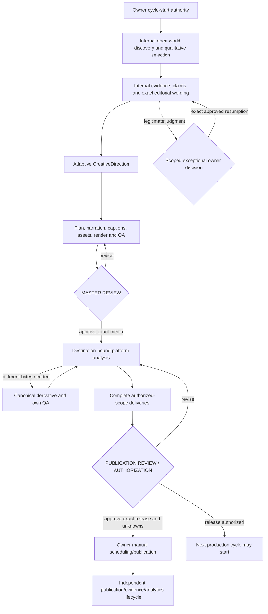

# Magnivis V3 — blocker remediation owner review

Final gate: **AHMET — MAGNIVIS V3 REMEDIATION REVIEW**.

## Executive summary

The five accepted blockers have been remediated prospectively. Destination evidence now matches the actual variant platform/surface; new canonical media becomes visible during the same execution; releases require the original complete platform scope; independent cycle journals support backlog production; and editorial judgment resumes only with its exact journal-authorized owner exception.

There remain **two normal owner gates per short-form cycle**: **MASTER REVIEW**, then **PUBLICATION REVIEW / AUTHORIZATION**. Topic, claim, editorial, direction, plan and caption review are internal work unless a legitimate exceptional condition requires owner authority.

The repository controller can run a supplied session executor through internal stages until Master Review, including registering fresh media without restarting. This is tested with newly generated engineering fixture media, not a pre-existing historical master. It is not a turnkey AI/render producer: a Codex session or executor still performs real search, source inspection, scene authoring, rendering and QA. No daemon, publisher, scheduler, scraper or external importer was added.

Backlog production is supported: Cycle A can remain authorized/scheduled with publication evidence pending while Cycle B reaches Master Review; Cycle A's late publication evidence leaves B unchanged; multiple authorized cycles remain independently addressable. Identical media references one canonical artifact. A fresh derivative is independently registered, checked and delivered when presentation needs different bytes. Historical media/evidence was not modified.

After owner acceptance of this review and the documented limitations, followed by authorized integration, Cycle #4 can begin through a deliberate cycle-start instruction and accountable session execution. This remediation has not started it, inferred historical publication, or granted external release authority.

## 1. Exact remediation of the five blockers

### Destination-bound presentation

Root cause: release inspection checked evidence against its profile but never compared the mutually consistent pair to the variant destination.

`src/workflow/release.ts` now requires both profile and evidence platform/surface to equal the actual variant destination. Existing exact media/profile hash checks remain. Tests construct internally consistent YouTube evidence/profile attached to a TikTok variant, wrong surfaces, and Instagram evidence attached to Facebook; release inspection rejects them. A fresh derivative referencing the master's evidence also fails.

Known collisions remain unwaivable. Unknown geometry/device/timeline knowledge remains explicit uncertainty; no measured geometry or device pass was invented.

### Live authoritative media catalog

Root cause: the CLI loaded an immutable registry once, so media created later could not resolve during the same run.

`src/artifacts/catalog.ts` adds:

- `openMediaCatalog`: a live view of the authoritative on-disk catalog. Catalog changes are reloaded and validated; previously observed records cannot disappear or change.
- `persistMediaArtifact`: exclusive registration, validation of bytes/provenance/parents, duplicate prevention, immutable metadata, and atomic catalog replacement. Repeating exactly the same registration is idempotent; a new path with identical bytes fails and must reference the existing canonical path.

`scripts/cycle.ts run` uses this live view for execution, transition validation and persistence. Newly registered narration/assets/candidate/derivative/covers use the same generic interface; no content names or permanent path allowlists are encoded.

The integration fixture begins with narration inputs only. During production it generates a new color/silence MP4 in temporary storage, registers it, proves that the initial snapshot cannot resolve it, and reaches Master Review through the live catalog. After approval it generates and registers a second MP4 as a derivative whose parent is the new master. Both resolve in the same lifecycle.

Fixture qualification: this is an engineering contract test with explicitly synthetic inspection/QA/owner records, using existing schema-valid editorial/timing inputs. It does not claim to have created publishable content or renewed historical factual/device evidence. No approved media was rendered or re-encoded.

### Authorized platform coverage

Root cause: preflight covered targetPlatforms, but release/closure accounting only considered whichever deliveries were submitted.

`validatePlatformCoverage` binds release destinations to cycle-start authority. Presentation completion and cycle validation/replay require all and only authorized platforms. Closure first validates that same release scope, then requires publication evidence for every variant. Four-to-three and four-to-one releases fail at the real presentation transition; a requested destination replaced by an unrequested platform fails. Complete coverage passes.

No scope amendment was introduced. `targetPlatforms` cannot be silently mutated; changing the authority file breaks its bound hash and journal replay. A future legitimate scope-amendment model is outside this remediation.

### Backlog production and project state

Root cause: one shared active-cycle pointer remained occupied until all external publication evidence existed.

`src/workflow/store.ts` now initializes independent, exclusively named cycle directories. Every cycle retains its own authority, state, event hashes, locking, replay and recovery. There is no shared mutable active-cycle flag or global publication-completion lock.

`loadProjectCycles` replays journals. `projectCycleOverview` derives:

- production-active cycles;
- owner actions with explicit cycle IDs/gates;
- publication-authorized cycles;
- owner-reported scheduled cycles;
- exact variants still awaiting publication evidence;
- closed cycles.

`workflow/project-state.json` remains project-level engineering/review metadata and a historical evidence index. Journals own prospective lifecycle truth. `scripts/cycle.ts status` without an ID reports the entire overview; named commands remain unambiguous. The compatibility helper refuses to choose silently when multiple production/review cycles exist.

The integration test starts B while A is scheduled/unpublished, advances B to Master Review, records A's publication, and verifies B's state bytes are unchanged. It subsequently authorizes B and verifies both releases remain addressable, then initializes C. Cross-cycle discovery/publication observations fail. Exact repeated scheduling/publication evidence is idempotent; conflicting duplicate publication identities fail.

### Inspectable editorial exception resumption

Root cause: an approved exception cleared a pause, but editorial validation still rejected the flagged review or required erasing its flags without an authority relationship.

Editorial distinguishes:

- **Non-overridable evidence/factual conditions:** existing `exceptionalConditions`, unsupported/conflicting/uncertain selected facts, missing inspection/evidence, and qualification failures remain blocking.
- **Owner judgment/authority:** high-care treatment and typed rights/legal/brand/operational judgment conditions may resume with exact owner authority.

Escalation binds the original review and exception envelope. Resumed review retains its original judgment and adds `exceptionResumptions`: exception record, decision record, and resumption time. Validation requires the exact proposal, same cycle, approved decision already in the journal, latest scoped authority, and validity at the actual editorial event. Rejected, unrelated, expired, superseded or cross-cycle decisions fail. Backdating resumption does not bypass event-time expiry.

The resulting internal editorial authority includes exception decision digests; package/asset/direction/plan bindings preserve that relationship downstream. Creative exceptional approval also enforces supplied expiry/superseded state. Unsupported claims cannot become verified merely because the owner approves a treatment choice.

## 2. Directly related corrections

- Discovery, retry and exception targets now check cycle identity; direction exceptions can instead prove binding to that cycle's editorial sources.
- Operational observation ingestion is idempotent for identical hash/kind; conflicting publication IDs or remote identities fail.
- Authorized upload CLI replays the actual persisted cycle and requires the exact authorized release/decision. Pure release inspectors validate supplied contracts and are not substitutes for authoritative journal loading.
- Project status derives outstanding publication variants instead of treating all authorized cycles as equally unobserved.

No paid services, distributed infrastructure, autonomous external publishing, historical migration, cleanup or branch merges were introduced.

## 3. Normal workflow after remediation

Discovery/search breadth, source meaning, subjective creative quality, actual render execution and device evidence remain accountable session work. Hash-bound structured state removes repeated continuation gates; it does not make model assertions into truth.

## 4. New generic coverage and adversarial results

Five additional generic tests bring the suite to **438 tests in 44 files**. The new coverage includes a real ffmpeg/probe fresh-media fixture and full persisted lifecycle, rather than only pre-registered historical media or mocked byte resolution.

| Attack | Result |
|---|---|
| Matching profile/evidence for wrong destination or surface | Rejected at release inspection |
| Instagram evidence for Facebook | Rejected |
| Master evidence used for fresh derivative | Rejected |
| Wrong media hash/reference | Rejected |
| Initial stale registry resolves fresh candidate | Rejected; live catalog resolves it |
| Remove/rewrite known catalog identity | Rejected |
| Duplicate identical payload at a second path | Rejected |
| Corrupt canonical bytes | Resolution fails |
| Four requested, three/one delivered | Presentation completion fails |
| Unrequested platform substitution | Scope fails |
| Close after only one actual publication | Fails; all required variants remain pending |
| Start B while A awaits publication | Passes |
| Late A evidence changes B | B state bytes remain identical |
| A discovery/publication record supplied to B | Rejected |
| Multiple pending release cycles | Independently addressable |
| Repeated identical observation | No new revision/event |
| Conflicting duplicate publication | Rejected |
| Unrelated/expired/superseded exception | Rejected |
| Owner preference overrides unsupported fact | Rejected |
| Wrong manifest digest | Publication binding fails |
| Rejected publication decision resolves upload | Rejected |
| Internal executor submits owner decision | Rejected |
| Unsupported lifecycle transition | Rejected |
| Unknown geometry/mobile evidence | Remains owner-risk-review, requiring explicit acceptance |

These are local contract guarantees. They do not prove external platform state, authenticated owner messages, source truth, subjective quality, or native-device presentation where no actual evidence exists.

## 5. Validation

- Supported runtime: Node **22.23.3**.
- `pnpm check`: typecheck, lint, all **438 tests / 44 files**, and diff hygiene passed.
- `validate-workflow-v3.ts` with preservation checkpoint: passed; zero real V3 cycles; engineering-review remains paused.
- `validate-artifact-v2.ts`: passed; all **366 imported identities**, canonical payloads and historical scope retained.
- `validate-chocolate-publication.ts`: passed; **902 preserved files**, 37 retained release artifacts.
- `validate-longitude-publication.ts`: passed; **605 preserved files**, 34 retained release artifacts.
- `validate-chocolate-production.ts`: passed.
- `validate-longitude-v2.ts`: passed; canonical narrator `af_heart`, retained narrator-review artifacts preserved.
- `validate-adaptive-creative-system.ts`: passed; existing narrator/duration/adaptive policy checks remain.
- `verify-durable-artifacts.ts`: passed; **731 records**, **366 canonical payloads**, **442 frozen legacy binary paths**; Wood Frog missing-original expectation retained.
- Explicit checkpoint hash verification: **948 historical files + 33 audit records**, zero mismatches.
- Scoped credential scan: no credentials detected. The broad assignment rule matched the unchanged documentation placeholder `set-outside-the-repository`; reviewed as a noncredential, not suppressed as a real secret.
- Isolated local clone with complete Git history and current engineering overlay: typecheck/lint, workflow/preservation, durability and full serialized test suite passed (isolated runner wall-clock allowance: 30 seconds per test; unchanged assertions). Existing pinned dependencies were reused via node_modules symlink; this does not establish a network/offline dependency reinstall.

The initial isolated parallel run hit three historical 5-second timeouts; a serialized run passed at the default limit, and a subsequent run hit one 5.15-second historical timeout. Final isolated validation uses one worker and a runner-only 30-second wall-clock allowance for synchronous Git-history checks. Assertions, source tests and repository timeout policy are unchanged. The normal working-tree pnpm check passed under its original limits. This is a test-harness timing limitation, not a claimed production latency benchmark.

## 6. Files/components changed in this remediation

- `src/artifacts/catalog.ts`: new live authoritative catalog/registration API.
- `src/workflow/release.ts`: actual destination binding.
- `src/workflow/cycle.ts`: scope, cycle isolation, scoped exception authority, observation idempotency.
- `src/workflow/store.ts`: independent journals/project overview/backlog.
- `src/workflow/topic-selection.ts`: durable cycle identity.
- `src/workflow/editorial.ts`, `authority-schema.ts`, `evidence.ts`: judgment resumption, validity and downstream authority.
- `scripts/cycle.ts`, `validate-workflow-v3.ts`, `resolve-delivery-media.ts`: live execution, portfolio state and journal-bound authorized CLI resolution.
- `tests/cycle-v3.test.ts`: fresh lifecycle and targeted adversarial regressions.
- `docs/WORKFLOW-V3.md`, `AGENTS.md`, `workflow/project-state.json`: correct authority/concurrency/capability descriptions.
- This handoff and its machine-readable validation summary; previous uncommitted V3 handoff is clearly marked superseded.

The final coherent engineering commit may also contain the earlier uncommitted V3 implementation already reviewed by Ahmet. No unrelated changes or historical media are included.

## 7. Historical state

Wood Frog recovery is closed, with missing original and accepted replacement kept separate. Phantom remains owner-reported published/closed. Longitude and Chocolate remain owner-reported scheduled; actual publication and metrics remain unknown. Narrator, open-world discovery, Adaptive Creative Direction, story-led duration, cadence, provisional window, historical approvals/hashes and recovery evidence remain intact.

There are no prospective production journals in this real repository. All synthetic lifecycle/media/evidence records created by tests live in temporary test directories and are cleaned up. No real topic, content cycle, production render, upload, schedule or publication was initiated.

## 8. Remaining specific non-blocking limitations

1. **Session executor:** the reusable controller and actual fresh-media/backlog lifecycle are executable, but a session must perform real discovery/production and supply receipts or an executor. No complete default AI/custom-render executor is included. A single owner prompt can authorize internal session work; the CLI start command itself is not a producer.
2. **Platform knowledge:** local checks prove supplied bounds against supplied versioned geometry, not native UI across unknown devices/surfaces. No new measurement/device capture was invented. Critical geometry completeness and report honesty remain review responsibilities.
3. **Profile renewal:** immutable profile records can be replaced prospectively, but authorization replay evaluates recorded profiles at the approval time. An operator must revisit stale knowledge before a later actual release; automatic latest-profile invalidation is not implemented.
4. **Crash durability:** pending event recovery remains deterministic. Abandoned locks, incomplete initialization, or ambiguous catalog pending files require explicit inspection. Atomic rename protects normal process-level writes; power-loss/fsync durability and automatic stale-lock reclamation are not guaranteed. No unsafe lock deletion was added.
5. **Scaling:** journal replay rechecks evidence/media, and project status scans journals. Canonical references reduce redundant bytes but unique media, evidence and Git history still grow. No throughput benchmark or 10,000-video infrastructure guarantee is claimed.
6. **External truth/import:** scheduling/publication/metrics remain supplied records. Hashes do not authenticate messages or platform behavior. Native import, scheduling, uploading and analytics scraping remain out of scope.
7. **Scope change:** original target platforms are strict; there is no implemented scope-amendment gate. A later policy may design one explicitly.

These limitations are exposed and do not restore normal topic/editorial/direction continuation gates or relax factual/presentation invariants.

## 9. Git and next action

Report assembly baseline: `architecture/magnivis-v3-workflow` at `3ba2bb2660e925b35427332894c38199bf0555b0`; main remains `cdebc2d1c92e14137dfef0dd9acb5924c460bed2`; V2 remains exact ancestor `46322f0f5174d2639a03b5378ff7c7d90d8fa77b`. No merge/rebase/history rewrite occurred.

This report is assembled before the authorized final commit/push attempt. The final response records the verified resulting commit/remote state or the exact environment block; no commit/push success is inferred here. Only one coherent engineering commit is intended. Main integration requires separate explicit owner authority.

Next human action: **AHMET — MAGNIVIS V3 REMEDIATION REVIEW**. Review the five fixes and accept or reject the stated limitations. If accepted, authorize integration; then separately authorize Cycle #4. No content work proceeds from this report alone.

**B. READY WITH SPECIFIC NON-BLOCKING LIMITATIONS**
